# Adversarial Oversight Protocol

**Classification**: Procedural Memory | Quality Assurance  
**Activation**: release, publish, promote skill, architecture change, security, critical  
**Priority**: MANDATORY - These gates cannot be bypassed

---

## Synapses

- [.github/agents/alex-validator.agent.md] → (Critical, Executes, Required) - "Validator agent performs adversarial review"
- [.github/instructions/code-review-guidelines.instructions.md] → (High, Implements, Forward) - "Code review follows adversarial checklist"
- [.github/instructions/release-management.instructions.md] → (Critical, Gates, Bidirectional) - "Releases require validation gate"
- [.github/instructions/heir-skill-promotion.instructions.md] → (High, Gates, Bidirectional) - "Skills require promotion readiness validation"
- [.github/instructions/architecture-decision-records.instructions.md] → (Medium, Triggers, Forward) - "Major changes need ADR + validation"
- [.github/instructions/empirical-validation.instructions.md] → (High, Strengthens, Bidirectional) - "Evidence-based validation methodology"
- [.github/agents/alex-builder.agent.md] → (High, Handoff, Bidirectional) - "Builder → Validator workflow"

---

## Core Principle

**Question everything before it ships.**

Adversarial oversight means having a **skeptical second pair of eyes** on quality-critical operations. The Builder agent creates optimistically; the Validator agent reviews skeptically.

| Without Adversarial Review | With Adversarial Review |
|----------------------------|--------------------------|
| Bugs reach production | Caught before release |
| Security vulnerabilities shipped | Blocked at validation gate |
| Technical debt accumulates silently | Identified and tracked |
| Assumptions go unchallenged | Edge cases explored |
| Single perspective bias | Constructive + adversarial balance |

---

## Mandatory Validation Gates

### 🔴 CRITICAL: Always Require Validator

These operations **MUST** trigger Validator agent review:

| Operation | Validator Trigger | Blocking Criteria |
|-----------|------------------|-------------------|
| **Release to Marketplace** | Before `vsce publish` | Any 🔴 Critical or 🟠 High issue |
| **Architecture ADR** | After ADR draft | Impact analysis incomplete |
| **Skill Promotion to Master** | Before merge to Master `.github/` | Promotion score < 12 OR trifecta incomplete |
| **Security-sensitive code** | Any auth/secrets/validation change | Security checklist incomplete |
| **Breaking changes** | Any major version bump | Migration path undefined |
| **Global Knowledge promotion** | Before `alex_knowledge_promote` | Pattern score < 5 OR missing citations |

### 🟠 HIGH: Strongly Recommend Validator

| Operation | Validator Trigger | Blocking Criteria |
|-----------|------------------|-------------------|
| **New agent creation** | After agent.md draft | Missing handoffs or unclear scope |
| **New trifecta** | After all 3 components created | Components don't reference each other |
| **Dependency updates** | Major or breaking changes | No fallback plan |
| **API design** | Before implementation | No error handling strategy |

### 🟡 MEDIUM: Optional but Valuable

| Operation | Validator Trigger | Use When |
|-----------|------------------|----------|
| **Documentation updates** | For critical user-facing docs | High risk of confusion |
| **Refactoring** | Large scope (5+ files) | Risk of regression |
| **Performance optimization** | Before/after benchmarks needed | Claims need verification |

---

## Validation Workflow

### Standard Pattern: Builder → Validator → Merge

```mermaid
%%{init: {'theme': 'base', 'themeVariables': { 'primaryColor': '#cce5ff', 'primaryTextColor': '#333', 'lineColor': '#666', 'edgeLabelBackground': '#fff'}}}%%
flowchart TD
    BUILD["Builder  creates/implements"] --> REQUEST["Request  Validation"]
    REQUEST --> VALIDATOR["Validator  reviews adversarially"]
    VALIDATOR -->|Critical Issues| BLOCK["🔴 Block  with detailed notes"]
    VALIDATOR -->|No Blockers| APPROVE["✅ Approve  with observations"]
    BLOCK --> FIX["Builder  addresses issues"]
    FIX --> VALIDATOR
    APPROVE --> MERGE["Merge/Release/Promote"]
    
    style BUILD fill:#cce5ff,stroke:#4a90d9,color:#333
    style REQUEST fill:#b3d9ff,stroke:#4a90d9,color:#333
    style VALIDATOR fill:#e6d5f2,stroke:#8b6eb3,color:#333
    style BLOCK fill:#ffd6d6,stroke:#d73a49,color:#333
    style APPROVE fill:#c2f0d8,stroke:#4db37d,color:#333
    style FIX fill:#cce5ff,stroke:#4a90d9,color:#333
    style MERGE fill:#c2f0d8,stroke:#4db37d,color:#333
    
    linkStyle default stroke:#57606a,stroke-width:1.5px
```



### How to Trigger Validator

**From Builder agent:**
```markdown
@Validator - Ready for adversarial review

**Context**: [What was built/changed]
**Scope**: [Files/components to review]
**Acceptance criteria**: [What success looks like]
```

**From Alex (orchestrator):**
Use agent handoff to Validator with:
- label: "🔍 Validate"
- prompt: "Review [component] for release readiness"
- send: true

**Manual invocation:**
User can directly invoke Validator agent with context.

---

## Validator Deliverables

Every Validator review **MUST** produce:

### 1. Status Decision
- ✅ **Approved with Notes** - No blocking issues, can proceed
- 🔴 **Blocked with Notes** - Critical/High issues must be resolved

### 2. Issue Report

```markdown
## Validation Report

### Summary
- **Status**: [✅ Approved / 🔴 Blocked] with Notes
- **Issues Found**: X critical, Y high, Z medium, W low

### Critical Issues (Blockers)
1. [Specific issue with location and reproduction steps]
   - **Severity**: 🔴 Critical
   - **Location**: `file.ts:line`
   - **Risk**: [What could go wrong]
   - **Suggestion**: [How to fix]

### High Issues (Should Fix)
[Same format]

### Medium/Low Issues (Consider)
[Same format]

### Observations
- ✅ [What was done well]
- 💡 [Suggestions for improvement]
- 📈 [Patterns to continue]
```

### 3. Checklist Completion

Domain-specific checklist based on operation type:

**Release Review:**
- [ ] CHANGELOG matches changes
- [ ] Version bump appropriate
- [ ] No uncommitted changes
- [ ] Documentation updated
- [ ] No security regressions
- [ ] Heir sync verified (if applicable)

**Skill Promotion Review:**
- [ ] Promotion readiness score ≥ 12
- [ ] No Master skill overlap
- [ ] Trifecta completeness verified
- [ ] Synapses present and valid
- [ ] ApplyTo patterns specified
- [ ] Examples include code

**Code Review:**
- [ ] See [code-review-guidelines.instructions.md] checklist

---

## Severity Classification (Standardized)

| Severity | Definition | Action |
|----------|------------|--------|
| 🔴 **Critical** | Security vulnerability, data loss risk, crash/corruption | **Block** - must fix before proceeding |
| 🟠 **High** | Bug affecting core functionality, broken feature | **Strongly recommend** fixing before merge |
| 🟡 **Medium** | Bug with workaround, quality issue, maintainability concern | Fix this sprint, track in backlog |
| 🟢 **Low** | Code smell, minor improvement, nice-to-have | Consider, not blocking |
| ⚪ **Info** | Observation, suggestion, learning opportunity | No action required |

---

## Integration Points

### Release Management
From [release-management.instructions.md]:

**Add to Step 4.5** (after present findings to user, before version bump):
```text
### Step 4.5: Adversarial Validation Gate

Action: Handoff to Validator agent for release review
Scope: All changes since last release
Deliverable: Validation report with approve/block decision

Blocker: If Validator blocks (🔴), resolve issues before version bump.
```

### Skill Promotion
From [heir-skill-promotion.instructions.md]:

**Add to Step 4.5** (after quality gate score):
```text
If score ≥ 12 AND trifecta complete:
  → Hand off to Validator for promotion review
  → Validator checks: generalizability, overlap, quality
  → If approved: proceed to Step 5 (promote)
  → If blocked: Builder refines based on feedback
```

### Code Review
From [code-review-guidelines.instructions.md]:

**Add to High Priority reviews**:
```text
For security-sensitive, breaking changes, or architectural PRs:
  → Request Validator agent review alongside human review
  → Validator provides adversarial perspective on checklist items
  → Both human + Validator approval required
```

---

## Anti-Patterns to Avoid

| ❌ Don't | ✅ Do Instead |
|----------|---------------|
| Skip validation "just this once" | Use expedited validation for urgent fixes |
| Argue with Validator findings defensively | Acknowledge issue, discuss severit classification |
| Merge blocked changes | Resolve blockers OR get explicit override with documented rationale |
| Use Validator for style preferences | Focus on correctness, security, architecture |
| Validation after release | Validation BEFORE release (pre-flight gate) |

---

## Expedited Validation (Emergency Use Only)

For critical hotfixes where full review would delay urgent fix:

**Requirements:**
1. Security issue OR production-down severity
2. Scope limited to minimum viable fix
3. Follow-up full validation scheduled
4. Override documented in commit message

**Process:**
```bash
git commit -m "hotfix: [issue] - EXPEDITED (followup validation in #XXX)"
```

**Validator reviews post-merge** to ensure no new issues introduced.

---

## Success Metrics

Adversarial oversight succeeds when:

- [ ] Zero critical bugs reach production
- [ ] Security vulnerabilities caught before release
- [ ] Promoted skills have high quality (reusable, clear, complete)
- [ ] ADRs capture true rationale (challenged assumptions documented)
- [ ] Builder-Validator collaboration is constructive (not adversarial personally)

---

## Quick Reference: When to Invoke Validator

```mermaid
%%{init: {'theme': 'base', 'themeVariables': { 'primaryColor': '#cce5ff', 'primaryTextColor': '#333', 'lineColor': '#666', 'edgeLabelBackground': '#fff'}}}%%
flowchart TD
    TASK["Task or Change"] --> CRITICAL{"Critical operation?"}
    CRITICAL -->|Yes| MANDATORY["🔴 MANDATORY  Validator Review"]
    CRITICAL -->|No| HIGH{"High risk?"}
    HIGH -->|Yes| RECOMMENDED["🟠 RECOMMENDED  Validator Review"]
    HIGH -->|No| OPTIONAL["🟡 Optional  Consider for complex work"]
    
    MANDATORY --> REVIEW["Validation Gate"]
    RECOMMENDED --> REVIEW
    OPTIONAL --> REVIEW
    
    REVIEW --> REPORT["Validator Delivers Report"]
    REPORT --> BLOCKED{"Blocked?"}
    BLOCKED -->|Yes| FIX["Fix Issues"]
    BLOCKED -->|No| PROCEED["Proceed with Confidence"]
    FIX --> REVIEW
    
    style TASK fill:#b3d9ff,stroke:#4a90d9,color:#333
    style CRITICAL fill:#e6d5f2,stroke:#8b6eb3,color:#333
    style HIGH fill:#e6d5f2,stroke:#8b6eb3,color:#333
    style MANDATORY fill:#ffd6d6,stroke:#d73a49,color:#333
    style RECOMMENDED fill:#ffe8cc,stroke:#d9822b,color:#333
    style OPTIONAL fill:#fff8dc,stroke:#9a6700,color:#333
    style REVIEW fill:#e6d5f2,stroke:#8b6eb3,color:#333
    style REPORT fill:#cce5ff,stroke:#4a90d9,color:#333
    style BLOCKED fill:#e6d5f2,stroke:#8b6eb3,color:#333
    style FIX fill:#ffe8cc,stroke:#d9822b,color:#333
    style PROCEED fill:#c2f0d8,stroke:#4db37d,color:#333
    
    linkStyle default stroke:#57606a,stroke-width:1.5px
```



---

*Adversarial oversight — because prevention beats remediation*
