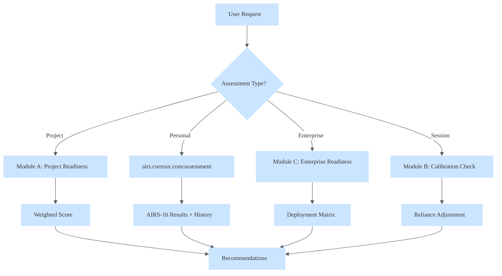

# Skill: AIRS Integration

> Practical application of AIRS psychometric assessment for AI readiness, reliance calibration, and adoption optimization.

## Metadata

| Field | Value |
|-------|-------|
| **Skill ID** | airs-integration |
| **Version** | 1.0.0 |
| **Category** | Research Tools |
| **Difficulty** | Advanced |
| **Prerequisites** | airs-appropriate-reliance |
| **Related Skills** | cognitive-load-management, frustration-recognition |

---

## Overview

This skill bridges theoretical AIRS knowledge with practical application workflows. It enables Alex to conduct readiness assessments, calibrate reliance per-session, evaluate organizational deployment, and self-monitor for over/under-reliance patterns.

### Core Value Proposition

AIRS (AI Readiness Scale) extends UTAUT2 to predict AI adoption with superior explanatory power. The **key finding** (Correa, 2025): **Price Value (PV) β=.505** is the strongest predictor of Behavioral Intention — twice as powerful as any other construct.

### Self-Assessment Link

**For users seeking their own AIRS assessment:**
> Take the validated AIRS-16 at **[airs.correax.com/assessment](https://airs.correax.com/assessment)**

---

## Module A: Project AI Readiness Assessment

Evaluate a user's project for AI integration readiness before investing development resources.

### Readiness Dimensions

| Dimension | AIRS Construct | Key Questions |
|-----------|---------------|---------------|
| **Value Clarity** | Price Value (PV) | Is the ROI clearly articulated? Can we quantify cost savings? |
| **Technical Fit** | Effort Expectancy (EE) | Will AI reduce complexity or add it? Integration friction? |
| **Use Case Validity** | Performance Expectancy (PE) | Will AI actually improve outcomes for this task? |
| **User Readiness** | Hedonic Motivation (HM) | Will users find the AI features engaging or threatening? |
| **Social Dynamics** | Social Influence (SI) | Do stakeholders champion or resist this AI integration? |

### Readiness Score Calculation

```
Project_Readiness = (PV_score × 2.0) + (EE_score × 1.5) + (PE_score × 1.2) + (HM_score × 0.8) + (SI_score × 0.5)
Max = 30 points
```

**Weighting rationale**: PV doubled because β=.505 is 2× stronger than other predictors.

### Scoring Thresholds

| Score | Readiness Level | Recommendation |
|-------|-----------------|----------------|
| 24-30 | High Readiness | Proceed with AI integration |
| 18-23 | Moderate Readiness | Address gaps before proceeding |
| 12-17 | Low Readiness | Significant preparation needed |
| <12 | Not Ready | Fundamental issues — pause and reassess |

### Assessment Protocol

**When user asks**: "Is my project ready for AI?" / "Should we add AI to this?" / "AI readiness check"

**Execute**:

1. **Value Discovery** (PV Focus)
   - "What cost savings or efficiency gains do you expect?"
   - "How would you measure ROI for this AI feature?"
   - Score 1-5 based on clarity of value proposition

2. **Effort Assessment** (EE Focus)
   - "How complex is the integration with existing systems?"
   - "What's the learning curve for users?"
   - Score 1-5 based on friction level

3. **Performance Validation** (PE Focus)
   - "What specific outcomes will improve with AI?"
   - "Do you have baseline metrics to compare against?"
   - Score 1-5 based on outcome clarity

4. **Engagement Potential** (HM Focus)
   - "Will users find this AI feature enjoyable or intimidating?"
   - "Is there existing enthusiasm for AI in this context?"
   - Score 1-5 based on user receptivity

5. **Stakeholder Map** (SI Focus)
   - "Who are the AI champions in this project?"
   - "What resistance have you encountered?"
   - Score 1-5 based on social support

6. **Calculate & Report**
   - Apply weighted formula
   - Identify weakest dimension
   - Provide targeted recommendations

---

## Module B: Session Reliance Calibration

Optimize user reliance on Alex during active sessions using real-time calibration.

### The Calibration Problem

| Pattern | Description | Risk |
|---------|-------------|------|
| **Over-reliance** | Accepting Alex outputs without verification | Errors propagate silently |
| **Under-reliance** | Ignoring Alex suggestions, doing everything manually | Efficiency loss, fatigue |
| **Appropriate Reliance** | Verifying when uncertain, trusting when confident | Optimal outcomes |

### CAIR/CSR Framework (Schemmer et al., 2023)

| | User Accepts | User Rejects |
|--|--------------|--------------|
| **AI Correct** | ✅ CAIR (Correct AI-Reliance) | ❌ Under-reliance |
| **AI Incorrect** | ❌ Over-reliance | ✅ CSR (Correct Self-Reliance) |

### Session Calibration Signals

**Over-reliance indicators**:
- Accepting all suggestions without modifications
- Not verifying AI-generated code before running
- Asking Alex to make decisions user should own
- "Just do it" without reviewing approach

**Under-reliance indicators**:
- Ignoring Alex suggestions repeatedly
- Manually typing code Alex already generated
- Rejecting help before evaluating it
- "I'll do it myself" after requesting help

### Calibration Interventions

**For over-reliance** (High TR, Low AR):
> "I notice you're trusting my outputs quickly. For this [critical/complex] task, would you like to review together? I want to make sure we catch any issues early."

**For under-reliance** (Low TR, Any AR):
> "I see you're preferring to work manually. That's totally valid — but I could help with [specific subtask] to save time. Would you like to try a hybrid approach?"

### Session Start Calibration Check

At session start (or when `/calibrate` invoked):

1. "On a scale of 1-5, how much are you planning to rely on AI for today's work?"
2. "What's your verification strategy for AI-generated output today?"
3. Adjust interaction style based on answers:
   - High reliance intent → Add more "let me explain my reasoning" moments
   - Low reliance intent → Be more assertive about high-confidence suggestions

---

## Module C: Enterprise Deployment Readiness

Assess organizational readiness for AI tool deployment at scale.

### The Price Value Imperative

**Critical insight**: PV (β=.505) suggests organizations must lead with ROI clarity. "AI is cool" fails. "AI will save 40% on X" succeeds.

### Enterprise Readiness Framework

| Domain | Assessment Focus | AIRS Link |
|--------|-----------------|-----------|
| **Business Case** | Clear, quantified value proposition | PV (primary driver) |
| **Technical Infrastructure** | Integration readiness, data quality | EE |
| **Change Management** | Training programs, champion network | FC, SI |
| **User Experience** | Ease of adoption, enjoyment potential | EE, HM |
| **Governance** | Policies, ethics frameworks, oversight | FC |

### Typology-Based Deployment Strategy

From AIRS research (Correa, 2025):

| User Type | AIRS Score | Deployment Role | Strategy |
|-----------|------------|-----------------|----------|
| **AI Enthusiasts** | >30 | Early adopters, champions | Recruit as internal advocates, beta testers |
| **Moderate Users** | 21-30 | Mainstream adoption | Lead with value proof, reduce friction |
| **AI Skeptics** | ≤20 | Late adoption | Peer influence, gradual exposure, choice |

### Enterprise Assessment Protocol

**When user asks**: "Is my org ready for AI?" / "AI deployment assessment" / "Enterprise readiness"

**Execute**:

1. **Business Case Review** (PV Focus)
   - "Do you have a quantified ROI for this AI deployment?"
   - "What's the cost of NOT implementing AI?"
   - Red flag: No clear numbers = Not ready

2. **Technical Readiness** (EE Focus)
   - "How will AI integrate with existing workflows?"
   - "What data quality issues exist?"
   - Red flag: Major integration gaps = High risk

3. **Change Readiness** (SI + FC Focus)
   - "Who are your AI champions at each level?"
   - "What training/support is planned?"
   - Red flag: No champion network = Adoption failure likely

4. **User Segmentation** (All Constructs)
   - "Have you assessed user AI readiness profiles?"
   - Recommend: "Deploy AIRS-16 survey at [airs.correax.com/org/register](https://airs.correax.com/org/register)"
   
5. **Governance Check** (FC Focus)
   - "What AI policies are in place?"
   - "Who owns AI ethics decisions?"
   - Red flag: No governance = Liability risk

### Deployment Recommendation Matrix

| Business Case | Technical Ready | Change Ready | Recommendation |
|--------------|-----------------|--------------|----------------|
| ✅ | ✅ | ✅ | Full deployment |
| ✅ | ✅ | ❌ | Pilot with champions |
| ✅ | ❌ | ✅ | Technical sprint first |
| ❌ | Any | Any | STOP — build business case |

---

## Module D: Alex Self-Monitoring

Enable Alex to detect and correct reliance imbalances in real-time.

### Self-Monitoring Triggers

| Signal | Detection | Response |
|--------|-----------|----------|
| User accepts 5+ suggestions without edit | Counter tracking | Insert calibration moment |
| User rejects 3+ suggestions in a row | Rejection tracking | Offer meta-conversation |
| Complex task, no verification request | Task complexity scan | Proactively suggest review |
| User asks "just do it" on critical task | Phrase detection | Pause and confirm scope |

### Calibration Moments

**Periodic check-in** (every 15-20 interactions in active session):
> "Quick calibration check: Are you finding my suggestions on-target today? Anything I'm missing or over-explaining?"

**Post-error recovery**:
> "That didn't work as expected. Let's pause — what should I have caught earlier? This helps me calibrate better."

**Session wrap-up**:
> "Before we wrap: Any patterns you noticed in my suggestions? Times I was over-confident or too cautious?"

### Reliance Metrics (Per-Session)

| Metric | Formula | Target |
|--------|---------|--------|
| Acceptance Rate | Accepted / Total Suggestions | 60-80% (not too high, not too low) |
| Modification Rate | Modified / Accepted | 20-40% (healthy verification) |
| Rejection Rate | Rejected / Total | 10-30% (healthy skepticism) |

**Interpretation**:
- Acceptance >90% → Over-reliance concern
- Rejection >50% → Under-reliance or poor fit
- Modification 20-40% → Healthy calibration

### Self-Improvement Loop

When calibration issues detected:
1. Log pattern to episodic memory
2. Identify root cause (domain mismatch, explanation style, confidence miscommunication)
3. Adjust behavior in current session
4. If pattern persists, surface in meditation for architectural review

---

## Integration Workflows

### Complete AIRS Assessment Flow



### Key Links

| Resource | URL | Purpose |
|----------|-----|---------|
| Personal Assessment | [airs.correax.com/assessment](https://airs.correax.com/assessment) | Take AIRS-16 |
| Assessment History | [airs.correax.com/history](https://airs.correax.com/history) | Track changes over time |
| Org Deployment | [airs.correax.com/org/register](https://airs.correax.com/org/register) | Enterprise surveys |

---

## Quick Reference

### AIRS-16 Constructs

| Construct | Key Finding | Application |
|-----------|-------------|-------------|
| **Price Value (PV)** | β=.505 (strongest) | Lead with ROI — always |
| Performance Expectancy (PE) | Significant | Demonstrate outcomes |
| Effort Expectancy (EE) | Significant | Reduce friction |
| Hedonic Motivation (HM) | Significant | Make it enjoyable |
| Social Influence (SI) | Significant | Leverage champions |
| Habit (HA) | Significant | Build into workflow |
| Facilitating Conditions (FC) | Significant | Ensure support |
| Trust (TR) | Marginal (p>.05) | Trust alone ≠ adoption |

### The Trust Paradox

>Trust (TR) was marginal in AIRS-16 validation. This suggests:
>- Trust level alone doesn't predict adoption
>- **Calibration** (knowing when to trust) matters more
>- See `airs-appropriate-reliance` skill for AR extension hypothesis

---

## Activation Patterns

| Trigger | Response |
|---------|----------|
| "AI readiness", "ready for AI", "should we add AI" | Module A: Project Assessment |
| "calibrate", "reliance check", "am I over-relying" | Module B: Session Calibration |
| "enterprise AI", "org deployment", "scale AI" | Module C: Enterprise Assessment |
| `/calibrate` command | Session calibration check |
| High acceptance rate detected | Self-monitoring intervention |
| Complex task without verification | Proactive calibration moment |

---

## References

- Correa, F. (2025). AIRS-16 Validation Study (N=523, CFI=.975)
- Schemmer, M., et al. (2023). CAIR/CSR Framework for Appropriate Reliance
- Passi, S., Dhanorkar, S., & Vorvoreanu, M. (2024). AETHER: Appropriate Reliance Synthesis
- Venkatesh, V., et al. (2012). UTAUT2 Model

---

*Skill created: 2026-02-10 | Category: Research Tools | Status: Active*

---

## Synapses

- [.github/instructions/empirical-validation.instructions.md] (Critical, Validates, Bidirectional) - "AIRS is empirically validated scale"
- [.github/instructions/bootstrap-learning.instructions.md] (High, Measures, Forward) - "Calibrate learning effectiveness"
- [.github/skills/airs-appropriate-reliance/SKILL.md] (High, Extends, Forward) - "Extended AR framework"
