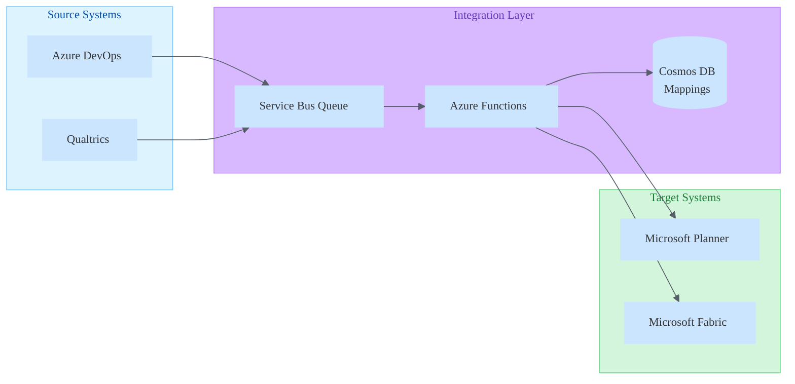

# API Design Skill

> Design APIs that developers love to use.

## Core Principle

A good API is intuitive, consistent, and hard to misuse. Design for the consumer, not the implementation.

## REST Fundamentals

### Resource Naming

| Good | Bad | Why |
|------|-----|-----|
| `/users` | `/getUsers` | Nouns, not verbs |
| `/users/123` | `/user?id=123` | Path params for identity |
| `/users/123/orders` | `/getUserOrders` | Hierarchical resources |
| `/search?q=term` | `/search/term` | Query params for filters |

### HTTP Methods

| Method | Purpose | Idempotent | Safe |
|--------|---------|------------|------|
| GET | Read resource | ✅ | ✅ |
| POST | Create resource | ❌ | ❌ |
| PUT | Replace resource | ✅ | ❌ |
| PATCH | Partial update | ❌* | ❌ |
| DELETE | Remove resource | ✅ | ❌ |

*PATCH can be idempotent if designed carefully

### Status Codes

| Code | Meaning | When to Use |
|------|---------|-------------|
| 200 | OK | Successful GET, PUT, PATCH |
| 201 | Created | Successful POST |
| 204 | No Content | Successful DELETE |
| 400 | Bad Request | Validation error, malformed request |
| 401 | Unauthorized | Missing/invalid authentication |
| 403 | Forbidden | Authenticated but not allowed |
| 404 | Not Found | Resource doesn't exist |
| 409 | Conflict | State conflict (duplicate, version) |
| 422 | Unprocessable | Valid syntax, invalid semantics |
| 429 | Too Many Requests | Rate limited |
| 500 | Internal Error | Server bug (never expose details) |

## Contract-First Design

### The Process
1. **Define the contract** (OpenAPI/Swagger)
2. **Review with consumers** before coding
3. **Generate server stubs** from contract
4. **Implement business logic**
5. **Validate responses** against contract

### OpenAPI Skeleton
```yaml
openapi: 3.0.3
info:
  title: My API
  version: 1.0.0
paths:
  /users:
    get:
      summary: List users
      parameters:
        - name: limit
          in: query
          schema:
            type: integer
            default: 20
      responses:
        '200':
          description: Success
          content:
            application/json:
              schema:
                $ref: '#/components/schemas/UserList'
components:
  schemas:
    User:
      type: object
      required: [id, email]
      properties:
        id:
          type: string
        email:
          type: string
          format: email
```

## Versioning Strategies

| Strategy | Example | Pros | Cons |
|----------|---------|------|------|
| URL Path | `/v1/users` | Explicit, easy routing | URL pollution |
| Header | `Accept: application/vnd.api.v1+json` | Clean URLs | Hidden, harder to test |
| Query Param | `/users?version=1` | Explicit, flexible | Looks like filter |

**Recommendation**: URL path for major versions. It's explicit and easy.

### Version Lifecycle
1. **Active**: Current version, fully supported
2. **Deprecated**: Works but sunset announced
3. **Sunset**: Removed, returns 410 Gone

## Pagination Patterns

### Offset-Based
```json
GET /users?offset=40&limit=20

{
  "data": [...],
  "pagination": {
    "offset": 40,
    "limit": 20,
    "total": 150
  }
}
```
- ✅ Simple, familiar
- ❌ Inconsistent on fast-changing data

### Cursor-Based
```json
GET /users?cursor=abc123&limit=20

{
  "data": [...],
  "pagination": {
    "next_cursor": "def456",
    "has_more": true
  }
}
```
- ✅ Consistent, performant
- ❌ No random access

## Error Response Design

### Consistent Structure
```json
{
  "error": {
    "code": "VALIDATION_ERROR",
    "message": "Invalid request parameters",
    "details": [
      {
        "field": "email",
        "message": "Must be valid email format"
      }
    ],
    "request_id": "req_abc123"
  }
}
```

### Error Principles
- Machine-readable code for programmatic handling
- Human-readable message for debugging
- Request ID for support correlation
- Never expose stack traces or internal details

## Request/Response Design

### Consistency Rules
- Use camelCase or snake_case—pick one, stick to it
- Timestamps in ISO 8601: `2026-02-01T14:30:00Z`
- IDs as strings (future-proof for UUIDs)
- Envelope responses: `{ "data": ..., "meta": ... }`

### Partial Responses
```
GET /users/123?fields=id,name,email
```
Reduces payload, improves performance.

### Bulk Operations
```json
POST /users/bulk
{
  "operations": [
    { "method": "create", "data": {...} },
    { "method": "update", "id": "123", "data": {...} }
  ]
}
```

## Caching Strategies

### HTTP Cache Headers

| Header | Purpose | Example |
|--------|---------|---------|
| `Cache-Control` | Caching directives | `max-age=3600, private` |
| `ETag` | Content fingerprint | `"abc123"` |
| `Last-Modified` | Timestamp of change | `Sat, 01 Feb 2026 12:00:00 GMT` |
| `Vary` | Cache key factors | `Accept, Authorization` |

### Cache-Control Directives

```http
# Public, cacheable for 1 hour
Cache-Control: public, max-age=3600

# Private (user-specific), cacheable for 5 minutes
Cache-Control: private, max-age=300

# No caching at all
Cache-Control: no-store

# Cache but revalidate every time
Cache-Control: no-cache

# Stale content OK while revalidating
Cache-Control: max-age=60, stale-while-revalidate=30
```

### ETag Validation Flow

```http
# First request
GET /users/123
→ 200 OK
   ETag: "v1-abc123"
   Cache-Control: private, max-age=60

# Subsequent request (after cache expires)
GET /users/123
If-None-Match: "v1-abc123"
→ 304 Not Modified (cache still valid)
   OR
→ 200 OK with new ETag (content changed)
```

### Caching Decision Matrix

| Resource Type | Cache Strategy | TTL |
|---------------|----------------|-----|
| Static config | `public, max-age` | Hours/days |
| User profile | `private, max-age` | Minutes |
| Real-time data | `no-store` | None |
| Search results | `private, max-age` | Seconds |
| Public listings | `public, s-maxage` | Minutes |

### Application-Level Caching

```typescript
// Cache key design
const cacheKey = `${resource}:${id}:${version}`;

// Cache-aside pattern
async function getUser(id: string) {
  const cached = await cache.get(`user:${id}`);
  if (cached) return cached;

  const user = await db.users.findById(id);
  await cache.set(`user:${id}`, user, { ttl: 300 });
  return user;
}

// Cache invalidation on write
async function updateUser(id: string, data: UserUpdate) {
  const user = await db.users.update(id, data);
  await cache.delete(`user:${id}`);
  await cache.delete(`users:list:*`); // Invalidate list caches
  return user;
}
```

### Cache Invalidation Strategies

| Strategy | When to Use | Complexity |
|----------|-------------|------------|
| TTL expiry | Low-stakes data | Low |
| Event-driven | Critical consistency | Medium |
| Version tags | Immutable resources | Low |
| Cache busting | Static assets | Low |
| Write-through | Always current | High |

---

## Rate Limiting

### Why Rate Limit?

- **Protect resources**: Prevent server overload
- **Ensure fairness**: No single client monopolizes
- **Cost control**: Limit expensive operations
- **Security**: Mitigate DoS and brute force

### Common Algorithms

| Algorithm | Description | Best For |
|-----------|-------------|----------|
| Fixed Window | X requests per minute | Simple APIs |
| Sliding Window | Rolling time window | Smoother limits |
| Token Bucket | Burst-friendly with refill | Flexible patterns |
| Leaky Bucket | Smooth output rate | Consistent throughput |

### Token Bucket Example

```typescript
class TokenBucket {
  private tokens: number;
  private lastRefill: number;

  constructor(
    private capacity: number,      // Max burst size
    private refillRate: number,    // Tokens per second
  ) {
    this.tokens = capacity;
    this.lastRefill = Date.now();
  }

  consume(tokens: number = 1): boolean {
    this.refill();
    if (this.tokens >= tokens) {
      this.tokens -= tokens;
      return true;
    }
    return false;
  }

  private refill() {
    const now = Date.now();
    const elapsed = (now - this.lastRefill) / 1000;
    this.tokens = Math.min(
      this.capacity,
      this.tokens + elapsed * this.refillRate
    );
    this.lastRefill = now;
  }
}
```

### Rate Limit Response Headers

```http
HTTP/1.1 200 OK
X-RateLimit-Limit: 100
X-RateLimit-Remaining: 95
X-RateLimit-Reset: 1706792400

# When exceeded
HTTP/1.1 429 Too Many Requests
Retry-After: 30
X-RateLimit-Limit: 100
X-RateLimit-Remaining: 0
X-RateLimit-Reset: 1706792400
```

### Rate Limit Tiers

| Tier | Limit | Use Case |
|------|-------|----------|
| Anonymous | 60/hour | Public exploration |
| Authenticated | 1000/hour | Normal usage |
| Premium | 10000/hour | Power users |
| Internal | Unlimited | Service-to-service |

### Rate Limit Scopes

```typescript
// Per-user limiting
const userKey = `ratelimit:user:${userId}`;

// Per-IP limiting (for anonymous)
const ipKey = `ratelimit:ip:${clientIp}`;

// Per-endpoint limiting
const endpointKey = `ratelimit:${method}:${path}`;

// Combined (most flexible)
const combinedKey = `ratelimit:${userId}:${method}:${path}`;
```

### Client-Side Rate Limit Handling

```typescript
async function apiCallWithRetry(request: Request): Promise<Response> {
  const response = await fetch(request);

  if (response.status === 429) {
    const retryAfter = parseInt(
      response.headers.get('Retry-After') || '60'
    );

    console.log(`Rate limited. Retrying in ${retryAfter}s`);
    await sleep(retryAfter * 1000);
    return apiCallWithRetry(request);
  }

  return response;
}

// Proactive rate limiting
class RateLimitedClient {
  private remaining: number = Infinity;
  private resetTime: number = 0;

  async request(url: string): Promise<Response> {
    // Wait if we know we're out of quota
    if (this.remaining <= 0 && Date.now() < this.resetTime) {
      await sleep(this.resetTime - Date.now());
    }

    const response = await fetch(url);

    // Update tracking from headers
    this.remaining = parseInt(
      response.headers.get('X-RateLimit-Remaining') || '100'
    );
    this.resetTime = parseInt(
      response.headers.get('X-RateLimit-Reset') || '0'
    ) * 1000;

    return response;
  }
}
```

### API Gateway Rate Limiting

Most API gateways support rate limiting out of the box:

```yaml
# AWS API Gateway
throttle:
  burstLimit: 100
  rateLimit: 50

# Azure API Management
<rate-limit calls="100" renewal-period="60" />

# Kong
plugins:
  - name: rate-limiting
    config:
      minute: 100
      policy: redis
```

---

## Enterprise API Integration Patterns

*Patterns from FishbowlGovernance multi-platform integrations (Feb 2026)*

### Microsoft Graph API (Planner)

**Key Limitations**:
| Constraint | Impact | Workaround |
|------------|--------|------------|
| Subscriptions expire after 3 days | Need timer-based renewal | Azure Function timer trigger |
| No native comments API | Cannot sync comments TO Planner | Use checklist items instead |
| 2400 tasks per plan limit | Monitor at threshold | Alert and archive old tasks |
| Task details require separate API call | Each has its own ETag | Batch carefully |
| Webhook requires public URL | Local dev challenge | Use ngrok or dev tunnels |
| User assignment needs Graph User ID | Must resolve from email/UPN | Cache user mappings |
| Tasks are flat (no hierarchy) | Can't mirror ADO parent/child | Map Features → Buckets |

**ETag Pattern for Updates**:
```http
PATCH /planner/tasks/{task-id}/details
If-Match: {etag}
Content-Type: application/json

{"description": "Updated description"}
```

### Azure DevOps REST API

**JSON Patch Pattern**:
```http
PATCH /_apis/wit/workitems/{id}?api-version=7.0
Content-Type: application/json-patch+json

[
  {"op": "add", "path": "/fields/System.Title", "value": "New Title"},
  {"op": "replace", "path": "/fields/System.State", "value": "Active"}
]
```

**Key Patterns**:
- Use `application/json-patch+json` content type
- Implement idempotency with WIQL queries before insert
- Link work items with relation URLs, not IDs
- Batch updates sequentially (parallel causes conflicts)

**WIQL Query for Duplicate Check**:
```http
POST /_apis/wit/wiql?api-version=7.0
Content-Type: application/json

{
  "query": "SELECT [System.Id] FROM WorkItems WHERE [System.Title] = 'Exact Title'"
}
```

### Qualtrics API v3

**Rate Limits by Endpoint**:
| Endpoint | Calls/Minute |
|----------|--------------|
| Survey definitions | 100 |
| Distributions | 3000 |
| Responses | 2000 |

**Integration Patterns**:
- Use webhook subscriptions for real-time events
- Poll distributions every 5-15 minutes
- Cache survey definitions (TTL: 1-4 hours)
- Flat JSON response structure (no nested objects)

### Microsoft Fabric REST API

**Async Operation Pattern** (202 Accepted):
```powershell
# 1. POST triggers async operation
$response = Invoke-WebRequest -Uri $uri -Headers $headers -Method Post

# 2. Get Location header for polling
if ($response.StatusCode -eq 202) {
    $operationUrl = $response.Headers["Location"][0]
    
    # 3. Poll until complete
    do {
        Start-Sleep -Seconds 2
        $status = Invoke-RestMethod -Uri $operationUrl -Headers $headers
    } while ($status.status -ne "Succeeded")
    
    # 4. Fetch result
    $result = Invoke-RestMethod -Uri "$operationUrl/result" -Headers $headers
}
```

**Token Acquisition**:
```powershell
# Fabric API token
$fabricToken = az account get-access-token --resource https://api.fabric.microsoft.com --query accessToken -o tsv

# Storage token (for Unity Catalog/schema-enabled lakehouses)
$storageToken = az account get-access-token --resource https://storage.azure.com --query accessToken -o tsv
```

### Multi-Platform Sync Architecture



**Key Design Principles**:
1. **Decouple with queues** — Service Bus between source and target
2. **Persist mappings** — Cosmos DB for ID correlation
3. **Timer renewals** — Subscription expiry handled automatically
4. **Accept limitations** — Some features (Planner comments) simply not feasible

---

## Security Checklist

```text
□ Authentication on all non-public endpoints
□ Authorization checked for each resource
□ Rate limiting enabled
□ Input validation (size limits, type checking)
□ No sensitive data in URLs (tokens, passwords)
□ CORS configured appropriately
□ Security headers set
□ Audit logging for sensitive operations
```

## Documentation Requirements

Good API docs include:
- **Authentication**: How to get and use tokens
- **Quick Start**: Working example in < 5 minutes
- **Reference**: Every endpoint, parameter, response
- **Errors**: All error codes and recovery steps
- **Changelog**: What changed in each version
- **SDKs**: Client libraries if available

## API Review Checklist

Before shipping an API:

```text
□ Resource names are nouns, plural
□ HTTP methods match semantics
□ Status codes are appropriate
□ Error responses are consistent
□ Pagination is implemented for lists
□ Versioning strategy is clear
□ Authentication is documented
□ Rate limits are defined
□ Breaking changes are versioned
□ OpenAPI spec is accurate
```

## Synapses

See [synapses.json](synapses.json) for connections.
