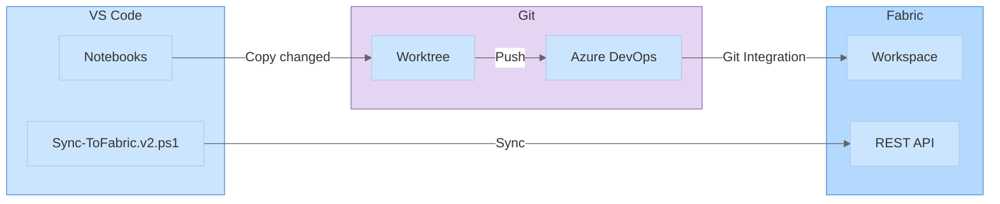

# Fabric Notebook Publish Skill

**Domain**: Microsoft Fabric Notebook DevOps
**Version**: 2.0.0
**Status**: Active
**Last Validated**: Feb 2026

> ⚠️ **Staleness Watch**: Fabric's Git integration feature is still maturing. Watch for changes to sync behavior, supported item types (not all Fabric item types support Git sync), and whether GitHub support expands beyond ADO. Check [Fabric Git integration docs](https://learn.microsoft.com/en-us/fabric/cicd/git-integration/intro-to-git-integration) for updates.

---

## Overview

This skill enables seamless notebook publishing from VS Code to Microsoft Fabric via Azure DevOps Git integration. It provides change detection, automated CHANGELOG tracking, prerequisite validation, and selective sync capabilities.

## Activation Triggers

- "push to fabric", "sync to fabric", "publish notebook"
- "fabric notebooks", "notebook deployment"
- "sync notebooks", "deploy notebooks"
- "fabric git", "ADO worktree"
- "changelog", "track notebook changes"

## Architecture



## Fishbowl Color Palette

Use these pastel colors for diagrams:

| Purpose | Fill | Stroke |
|---------|------|--------|
| Primary | `#cce5ff` | `#4a90d9` |
| DevOps | `#e6d5f2` | `#8b6eb3` |
| Success | `#c2f0d8` | `#4db37d` |
| Warning | `#fff3b3` | `#d4a849` |
| Critical | `#ffcccc` | `#cc6666` |

## Workflow Options

| Script | Purpose | Best For |
|--------|---------|----------|
| `Sync-ToFabric.v2.ps1` | Git-based with change detection + CHANGELOG | Production |
| `Publish-ToFabric.ps1` | Direct API publish (bypasses Git) | Dev iteration |
| Manual | Copy → commit → push → portal sync | Fallback |

## Key Features

### Change Detection
- MD5 hash comparison between source and worktree
- Only syncs notebooks with actual changes
- Supports filter patterns: `-NotebookFilter "*Bronze*"`

### CHANGELOG Tracking
- Auto-appends entry to `CHANGELOG.Notebook`
- Records: timestamp, user, commit message, changed notebooks
- Location: `Fabric/Utilities/CHANGELOG.Notebook/notebook-content.py`

### Prerequisite Validation
- Checks Az module installed
- Validates Azure login
- Confirms worktree exists
- Verifies Git remote configured

## Configuration

All settings in `fabric-governance/scripts/fabric-publish/fabric-publish.config.json`:

```json
{
  "workspace": {
    "id": "c89fa577-76cf-461d-bff9-cd87f64f9d62",
    "name": "XODO Data Engineering"
  },
  "git": {
    "adoRemoteName": "fabric",
    "branch": "FishBowl",
    "worktreeRelativePath": "../../../../FishBowl-Fabric"
  },
  "changelog": {
    "enabled": true
  }
}
```

## Command Reference

### Sync v2 (Recommended)
```powershell
cd fabric-governance\scripts\fabric-publish

# Sync changed notebooks
.\Sync-ToFabric.v2.ps1 -CommitMessage "Update Bronze layer"

# Filter by pattern
.\Sync-ToFabric.v2.ps1 -NotebookFilter "*Bronze*" -CommitMessage "Bronze fixes"

# Preview (no changes)
.\Sync-ToFabric.v2.ps1 -DryRun

# Force sync all
.\Sync-ToFabric.v2.ps1 -Force -CommitMessage "Re-sync all"

# Git only (skip Fabric API)
.\Sync-ToFabric.v2.ps1 -SkipApi -CommitMessage "Stage for review"
```

### Direct Publish (Dev Only)
```powershell
.\Publish-ToFabric.ps1 -NotebookName "ArchiveData" `
    -NotebookPath "..\..\notebooks\Fabric\Data Engineering\Notebooks\Bronze_Layer\ArchiveData.Notebook\notebook-content.py"
```

## First-Time Setup

```powershell
# From repo root
git remote add fabric https://xodo-team.visualstudio.com/XODO/_git/XODO
git fetch fabric FishBowl
git worktree add ../FishBowl-Fabric fabric/FishBowl
cd ../FishBowl-Fabric
git checkout -b FishBowl --track fabric/FishBowl
```

## Error Handling

| Error | Solution |
|-------|----------|
| `Worktree not found` | Run first-time setup |
| `Not logged into Azure` | `Connect-AzAccount` |
| `Az module not installed` | `Install-Module -Name Az` |
| `401 Unauthorized` | Re-run `Connect-AzAccount` |
| `403 Forbidden` | Check workspace Admin/Member role |
| `Sync conflict` | Resolve in Fabric portal |

## Synapses

- [fabric-notebook-push.instructions.md](../../instructions/fabric-notebook-push.instructions.md) → Core procedural memory
- [git-workflow/SKILL.md](.github/skills/git-workflow/SKILL.md) → Git worktree management
- [microsoft-fabric/SKILL.md](.github/skills/microsoft-fabric/SKILL.md) → Fabric platform knowledge
- [api-design/SKILL.md](.github/skills/api-design/SKILL.md) → REST API token handling

## Related Files

| File | Purpose |
|------|---------|
| `Sync-ToFabric.v2.ps1` | Main sync script |
| `Publish-ToFabric.ps1` | Direct API publish |
| `fabric-publish.config.json` | Configuration |
| `NOTEBOOK-PUBLISH-TO-FABRIC.md` | User guide |
| `FABRIC-PUBLISH-WORKFLOW.md` | Workflow comparison |
