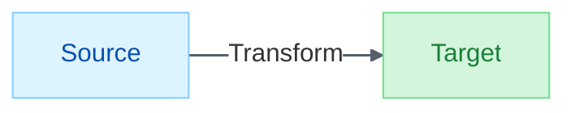

# Markdown & Mermaid

> Clear documentation through visual excellence

A skill for markdown authoring, Mermaid diagramming, multi-tool visualization, VS Code integration, and cross-platform rendering consistency.

## When to Use

- Creating technical documentation with diagrams
- Choosing the right diagramming tool for your audience
- Troubleshooting Mermaid rendering issues
- Styling markdown previews in VS Code
- Converting unicode escapes to proper emojis
- Enterprise documentation with visual standards
- **Interactive diagrams in VS Code chat** (1.109+)

---

## Mandatory Workflow: ATACCU

**Every Mermaid diagram MUST follow this 6-step protocol.** No exceptions — this prevents forgotten palettes, broken layouts, and inconsistent styling.

| Step | Action | What to Do |
| ---- | ------ | ---------- |
| **A** | **Analyze** | What data/process am I visualizing? Who is the audience? What diagram type fits? |
| **T** | **Think** | Which layout pattern? (Medallion/Lineage/Pipeline) How many nodes? Will it be too wide/tall? |
| **A** | **Apply Skills** | Load GitHub Pastel v2 palette. Select `classDef` colors by semantic meaning. Add `%%{init}%%` directive. Choose `direction` for subgraphs. |
| **C** | **Create** | Write the Mermaid code. Every node gets a style. Every flowchart gets `linkStyle default`. |
| **C** | **Check** | Render the diagram. Verify: pastels (not saturated), layout (not lopsided), labels (readable), arrows (gray #57606a). |
| **U** | **Update** | Write the final diagram into the target `.md` file. Add `**Figure N:** *description*` label. |

### Pre-Flight Checklist (Steps A-T-A)

Before writing any Mermaid code, answer these:

```text
□ Diagram type selected (flowchart/sequence/gantt/quadrant/etc.)
□ Layout direction chosen (LR preferred for flow, TD for hierarchy)
□ Subgraph strategy decided (Medallion vs Lineage vs Pipeline)
□ Color assignments mapped (what color = what meaning)
□ Init directive ready: %%{init: {'theme': 'base', 'themeVariables': ...}}%%
```

### Quality Gate (Steps C-C-U)

After creating the diagram, verify ALL of these:

```text
□ Init directive is FIRST line inside mermaid block
□ ALL nodes have style/classDef (no unstyled nodes)
□ Colors are GitHub Pastel v2 (NOT saturated: no #51cf66, #339af0, #fab005)
□ linkStyle default stroke:#57606a,stroke-width:1.5px (flowcharts)
□ Diagram rendered and visually inspected
□ No dimension > 3x the other (use subgroups to balance)
□ Figure label added below diagram block
□ Written to target file (not just shown in chat)
```

### Common Violations This Prevents

| Violation | ATACCU Step That Catches It |
| --------- | -------------------------- |
| Saturated colors instead of pastels | **Apply Skills** — load palette first |
| Missing init directive | **Apply Skills** — it's step 3 |
| Missing linkStyle | **Create** — every flowchart needs it |
| Lopsided layout (7-way fan-out) | **Think** — choose layout pattern |
| Diagram only in chat, not in file | **Update** — write to `.md` file |
| No figure label | **Update** — add label |

---

## VS Code 1.109+ Native Chat Rendering

VS Code 1.109 introduces **native Mermaid rendering in chat** via the `renderMermaidDiagram` tool.

### When to Use Native Rendering

When creating diagrams **in Copilot Chat** (not markdown files), use the native tool for:
- **Interactive exploration**: Pan, zoom, and full-screen viewing
- **Immediate feedback**: See diagrams without switching to markdown preview
- **Iterative refinement**: Quick edits with instant re-render
- **Copy source**: Extract the Mermaid code for documentation

### Usage Pattern

```text
User: Create a sequence diagram showing OAuth flow

Alex: [uses renderMermaidDiagram tool]
       → Interactive diagram appears in chat
       → User can pan/zoom/fullscreen
       → "Copy source" extracts code for docs
```

### When NOT to Use

- **Documentation authoring**: Use markdown code blocks for `.md` files
- **GitHub rendering**: Embed Mermaid in markdown for native GitHub support
- **Presentations**: Export to image formats or use D2

### Combined Workflow

1. **Design in chat**: Use `renderMermaidDiagram` for rapid iteration
2. **Finalize**: Copy the Mermaid source code
3. **Document**: Paste into markdown file with ` ```mermaid ` code fence

---

## Assets

| File | Purpose |
| ---- | ------- |
| `markdown-light.css` | VS Code preview styling |
| `polish-mermaid-setup.prompt.md` | Interactive Mermaid configuration helper |

**Setup:** Copy CSS to `.vscode/`, add `"markdown.styles": [".vscode/markdown-light.css"]` to settings.

**Mermaid Config:** Run the "Polish Mermaid Setup" prompt to configure Mermaid rendering for your VS Code environment.

---

## Markdown Best Practices

### Document Structure Template

```markdown
# Title

> Brief description or tagline

---

## Overview

Introductory paragraph explaining the purpose.

---

## Section 1

Content with proper formatting.

### Subsection 1.1

More detailed content.

---

## Tables

**Table N:** *Description of what the table shows*

| Column 1 | Column 2 |
| -------- | -------- |
| Data     | Data     |

---

## Diagrams

` ` `mermaid
flowchart LR
    A --> B
` ` `

**Figure N:** *Description of what the diagram shows*

---

*Footer or closing statement*
```

### Figure and Table Conventions

**Mandatory Labeling**: Every diagram and table MUST have a label:

```markdown
**Figure 1:** *Description in italics*
**Table 1:** *Description in italics*
```

- **Numbering**: Sequential within document, reset per document
- **Placement**: Label immediately follows the diagram/table block

---

## 🏷️ Shields.io Badges

### Badge Anatomy

Badges use [Shields.io](https://shields.io) - a free service for generating status badges.

**URL Structure:**

```text
https://img.shields.io/badge/{LABEL}-{MESSAGE}-{COLOR}?{OPTIONS}
```

**Markdown Syntax:**

```markdown
[](#)
```

### Style Options

| Style | Appearance | Parameter |
| ----- | ---------- | --------- |
| Flat | Minimal | `style=flat` |
| Flat-Square | Squared corners | `style=flat-square` |
| Plastic | Gradient | `style=plastic` |
| **For-the-Badge** | Large, bold | `style=for-the-badge` |
| Social | GitHub-like | `style=social` |

### Common Color Names

| Color | Name | Hex |
| ----- | ---- | --- |
| 🔵 | `blue` | `#007ec6` |
| 🟢 | `green` | `#97ca00` |
| 🟡 | `gold` / `yellow` | `#dfb317` |
| 🟠 | `orange` | `#fe7d37` |
| 🔴 | `red` | `#e05d44` |
| 🟣 | `purple` | `#9f4bc9` |
| 🔷 | `cyan` | `#25c2a0` |
| ⚫ | `gray` / `grey` | `#555555` |

**Custom Hex**: Use any hex without `#` → `?color=1f2328`

### Adding Icons (Simple Icons)

Shields.io integrates with [Simple Icons](https://simpleicons.org/) for brand logos:

```markdown
[](#)
```

**Parameters:**

- `logo=iconname` - Icon from Simple Icons (lowercase, no spaces)
- `logoColor=white` - Icon color (usually white for dark backgrounds)

### Badge Templates

**Version Badge:**

```markdown
[](#)
```

**Domain/Category Badge:**

```markdown
[](#)
```

**Quality Badge:**

```markdown
[](#)
```

**Status Badge:**

```markdown
[](#)
[](#)
[](#)
```

### Document Header Pattern

Professional documents use a badge row at the top:

```markdown
# Document Title

[](#) [](#)

> Description tagline

---
```

### Special Characters in Badges

| Character | Encode As |
| --------- | --------- |
| Space | `_` (underscore) or `%20` |
| Dash | `--` (double dash) |
| Underscore | `__` (double underscore) |

### Dynamic Badges (Advanced)

For live data from repos:

```markdown
[](#)
[](#)
[](#)
```

---

### Emoji Usage

**Best Practice**: Use actual emoji characters, not HTML entities or unicode escapes.

| Good ✅ | Bad ❌ |
| ------- | ------ |
| `# 🧠 Brain` | `# &#x1F9E0; Brain` |
| `**💻 Local**` | `**\ud83d\udcbb Local**` |

---

## 🎯 Diagram Tool Selection Framework

### Step 1: Identify Your Communication Goal

| What You're Showing | Best Tools | Example Use Cases |
| ------------------- | ---------- | ----------------- |
| **Process/Workflow** | Mermaid Flowcharts, User Journey | Onboarding, approvals, troubleshooting |
| **System Architecture** | Mermaid Flowcharts with subgraphs, D2 | Microservices, API design |
| **Relationships** | Mermaid ER, Mindmaps, Graphviz | Database schemas, org charts |
| **Time/Sequence** | Mermaid Sequence, Gantt | API interactions, timelines |
| **Data/Metrics** | Mermaid XY Charts, Sankey, Quadrant | Performance, resource allocation |

### Step 2: Consider Your Audience

| Audience | Primary Goal | Recommended Tools | Style |
| -------- | ------------ | ----------------- | ----- |
| **Executives** | Strategic overview | D2, simple flowcharts | Clean, minimal |
| **Architects** | Technical accuracy | PlantUML, Mermaid C4 | Detailed, precise |
| **Developers** | Implementation | Mermaid Sequence, Class | Code-focused |
| **Product Managers** | User flows | User Journey, Flowcharts | Business-outcome |
| **Documentation** | Learning | All Mermaid types | Progressive disclosure |

### Step 3: Consider Platform

| Platform | Best Tools | Why |
| -------- | ---------- | --- |
| **GitHub/GitLab** | Mermaid | Native rendering, no setup |
| **Confluence/Wiki** | Mermaid, PlantUML | Plugin support |
| **VS Code** | All tools (extensions) | Live preview |
| **Presentations** | D2, simple Mermaid | Executive-friendly |

### Quick Decision Tree

```text
Need diagram? → What are you showing?
├── Process/Workflow → Mermaid Flowchart
├── System Architecture → Mermaid with subgraphs (or D2 for exec)
├── Relationships → Mermaid ER/Mindmap (or Graphviz for complex)
├── Time/Sequence → Mermaid Sequence/Gantt
└── Data/Metrics → Mermaid XY/Sankey/Quadrant
```

---

## 🛠️ Multi-Tool Ecosystem

### Tool Comparison Matrix

| Tool | Native GitHub | Complexity | Best For |
| ---- | ------------- | ---------- | -------- |
| **Mermaid** | ✅ Yes | Low-Medium | General purpose, quick diagrams |
| **PlantUML** | ❌ No | Medium-High | Enterprise UML, AWS/Azure |
| **Graphviz** | ❌ No | High | Complex networks, dependencies |
| **D2** | ❌ No | Low | Clean architecture overviews |
| **WaveDrom** | ❌ No | Medium | Digital timing diagrams |

### VS Code Extension Setup

```json
{
  "recommendations": [
    "bierner.markdown-mermaid",
    "vstirbu.vscode-mermaid-preview",
    "mermaidchart.vscode-mermaid-chart",
    "jebbs.plantuml",
    "joaompinto.vscode-graphviz",
    "terrastruct.d2",
    "shd101wyy.markdown-preview-enhanced",
    "yzane.markdown-pdf",
    "bierner.markdown-preview-github-styles"
  ]
}
```

### Syntax Examples

**PlantUML** (Enterprise UML):

```text
@startuml
!theme aws-orange
participant User
participant System
participant Database

User -> System: Request
System -> Database: Query
Database --> System: Response
System --> User: Result
@enduml
```

**Graphviz DOT** (Complex Networks):

```text
digraph G {
    rankdir=TB;
    node [shape=box, style=filled, fillcolor=lightblue];
    A -> B;
    A -> C;
    B -> D;
    C -> D;
}
```

**D2** (Modern Architecture):

```text
users -> web_server: HTTPS requests
web_server -> database: SQL queries

users.style.fill: "#e1f5fe"
web_server.style.fill: "#f3e5f5"
```

---

## 🎨 Mermaid Diagram Reference

### ⚡ Quick Start — Pastel v2 Template

Copy this template for every new diagram. It sets the GitHub Pastel v2 palette defaults:

```text
%%{init: {'theme': 'base', 'themeVariables': { 'edgeLabelBackground':'#ffffff', 'lineColor': '#57606a' }}}%%
flowchart LR
    A[Source]:::blue --> B[Process]:::gold --> C[Output]:::green

    classDef blue fill:#ddf4ff,color:#0550ae,stroke:#80ccff
    classDef green fill:#d3f5db,color:#1a7f37,stroke:#6fdd8b
    classDef gold fill:#fff8c5,color:#9a6700,stroke:#d4a72c

    linkStyle default stroke:#57606a,stroke-width:1.5px
```

**Three things every diagram needs:**
1. `%%{init}%%` directive (first line)
2. `classDef` or `style` for node colors
3. `linkStyle default` for arrow color

> 💡 For color theory and design principles, see the **graphic-design** skill. The palette values here come from that skill's color system, optimized for GitHub rendering.

### Diagram Types

| Type | Syntax | Best Use Case |
| ---- | ------ | ------------- |
| Flowchart | `flowchart TB/LR/BT/RL` | Process flows, decision trees |
| Sequence | `sequenceDiagram` | API calls, interactions |
| State | `stateDiagram-v2` | State machines, lifecycles |
| Class | `classDiagram` | OOP design, relationships |
| ER | `erDiagram` | Database schema |
| Gantt | `gantt` | Project timelines |
| Pie | `pie` | Simple proportions |
| Mindmap | `mindmap` | Concept hierarchies |
| Quadrant | `quadrantChart` | 2D positioning analysis |
| Git Graph | `gitGraph` | Branch workflows |
| XY Chart | `xychart-beta` | Data plotting |
| Sankey | `sankey-beta` | Flow analysis |
| Block | `block-beta` | Block diagrams |

### Node Shapes (Flowchart)

```text
A[Rectangle]      B(Rounded)        C([Stadium])
D[[Subroutine]]   E[(Database)]     F((Circle))
G>Asymmetric]     H{Diamond}        I{{Hexagon}}
J[/Parallelogram/]
```

### Edge Styles

```text
A --> B           Standard arrow
A --- B           Line without arrow
A -.-> B          Dotted arrow
A ==> B           Thick arrow
A --"label"--> B  Labeled edge
A -->|"label"| B  Alternative label syntax
```

### Color Palette (Legacy — GitHub-Compatible)

> **Note:** Superseded by GitHub Pastel Palette v2 below. Kept for reference only.

| Purpose | Background | Border/Stroke |
| ------- | ---------- | ------------- |
| **GitHub Light** | `#f6f8fa` | `#d1d9e0` |
| **Text** | - | `#1f2328` |
| **Lines** | - | `#656d76` |
| **Success** | `#e8f5e9` | `#2e7d32` |
| **Info** | `#e3f2fd` | `#1565c0` |
| **Warning** | `#fff3e0` | `#ef6c00` |
| **Special** | `#f3e5f5` | `#7b1fa2` |
| **Danger** | `#ffebee` | `#c62828` |
| **Neutral** | `#f5f5f5` | `#424242` |

### GitHub Pastel Palette v2 (Default)

*Higher contrast, better accessibility. Always use this palette for new diagrams.*

**Node Style Pattern**: `style NODE fill:#FILL,color:#TEXT,stroke:#STROKE`

| Purpose | Fill | Text | Stroke | Usage |
| ------- | ---- | ---- | ------ | ----- |
| Bronze/Peach | `#fff1e5` | `#953800` | `#ffb77c` | Data ingestion, raw layer |
| Silver/Gray | `#eaeef2` | `#24292f` | `#afb8c1` | Processing, transformation |
| Gold/Yellow | `#fff8c5` | `#9a6700` | `#d4a72c` | Business logic, highlights |
| Blue/Sky | `#ddf4ff` | `#0550ae` | `#80ccff` | Actions, primary operations |
| Purple | `#d8b9ff` | `#6639ba` | `#bf8aff` | DevOps, tracking, special |
| Green/Mint | `#d3f5db` | `#1a7f37` | `#6fdd8b` | Success, validation, output |
| Red/Coral | `#ffebe9` | `#cf222e` | `#f5a3a3` | Errors, critical, warning |
| Neutral | `#eaeef2` | `#24292f` | `#d0d7de` | Background, containers |

**Arrow/Link Styling** (CRITICAL for readability):

```text
linkStyle default stroke:#57606a,stroke-width:1.5px
```

**Complete Example**:



**Key Principles**:
1. **Light fills** (#fff1e5, #ddf4ff) — Easy on the eyes
2. **Medium text** (#953800, #0550ae) — Readable but not harsh  
3. **Soft strokes** matching fill family
4. **Gray arrows** (#57606a) — Neutral, doesn't compete with nodes
5. **1.5-2px stroke-width** — Visible but not heavy
6. **edgeLabelBackground: '#fff'** — GitHub doesn't support transparent

### Fishbowl Pastel Palette (Alternative)

*Softer palette with uniform dark text. Good for governance, compliance, and presentation diagrams.*

| Purpose | Fill | Stroke | Text |
| ------- | ---- | ------ | ---- |
| Primary | `#cce5ff` | `#4a90d9` | `#333` |
| Light Blue | `#b3d9ff` | `#4a90d9` | `#333` |
| Lavender | `#e6d5f2` | `#8b6eb3` | `#333` |
| Mint | `#c2f0d8` | `#4db37d` | `#333` |
| Cream | `#fff3b3` | `#d4a849` | `#333` |
| Soft Pink | `#ffcccc` | `#cc6666` | `#333` |

**Init directive (Fishbowl):**

```text
%%{init: {'theme': 'base', 'themeVariables': { 'primaryColor': '#cce5ff', 'primaryTextColor': '#333', 'lineColor': '#666', 'edgeLabelBackground': '#fff'}}}%%
```

**When to choose Fishbowl over GitHub Pastel v2**: Use Fishbowl when all nodes need equal visual weight (e.g., governance structures, compliance flows). Use GitHub Pastel v2 when nodes carry semantic meaning that should be color-coded by category.

### Per-Diagram Theming (MANDATORY for consistency)

Add as FIRST line inside mermaid block:

**Default init directive (GitHub Pastel v2):**

```text
%%{init: {'theme': 'base', 'themeVariables': { 'edgeLabelBackground':'#ffffff', 'lineColor': '#57606a' }}}%%
```

**Standard GitHub-compatible theme (legacy):**

```text
%%{init: {'theme': 'base', 'themeVariables': { 'primaryColor': '#f6f8fa', 'primaryTextColor': '#1f2328', 'primaryBorderColor': '#d1d9e0', 'lineColor': '#656d76', 'secondaryColor': '#f6f8fa', 'tertiaryColor': '#ffffff', 'background': '#ffffff', 'mainBkg': '#f6f8fa', 'nodeBorder': '#d1d9e0'}}}%%
```

**Quadrant chart theme:**

```text
%%{init: {'theme': 'base', 'themeVariables': { 'quadrant1Fill': '#e8f5e9', 'quadrant2Fill': '#e3f2fd', 'quadrant3Fill': '#f3e5f5', 'quadrant4Fill': '#fff3e0', 'quadrant1TextFill': '#1f2328', 'quadrant2TextFill': '#1f2328', 'quadrant3TextFill': '#1f2328', 'quadrant4TextFill': '#1f2328', 'quadrantPointFill': '#1565c0', 'quadrantPointTextFill': '#1f2328'}}}%%
```

### classDef Reusable Styles

Define style classes once and apply to multiple nodes. Cleaner than per-node `style` directives.

```text
flowchart LR
    A[Source]:::input --> B[Process]:::action --> C[Output]:::success

    classDef input fill:#ddf4ff,color:#0550ae,stroke:#80ccff
    classDef action fill:#fff8c5,color:#9a6700,stroke:#d4a72c
    classDef success fill:#d3f5db,color:#1a7f37,stroke:#6fdd8b
    classDef error fill:#ffebe9,color:#cf222e,stroke:#f5a3a3
    classDef neutral fill:#eaeef2,color:#24292f,stroke:#d0d7de
    classDef special fill:#d8b9ff,color:#6639ba,stroke:#bf8aff
    classDef bronze fill:#fff1e5,color:#953800,stroke:#ffb77c
```

**Pastel v2 classDef Quick Reference** (copy-paste ready):

```text
classDef blue fill:#ddf4ff,color:#0550ae,stroke:#80ccff
classDef green fill:#d3f5db,color:#1a7f37,stroke:#6fdd8b
classDef purple fill:#d8b9ff,color:#6639ba,stroke:#bf8aff
classDef gold fill:#fff8c5,color:#9a6700,stroke:#d4a72c
classDef red fill:#ffebe9,color:#cf222e,stroke:#f5a3a3
classDef bronze fill:#fff1e5,color:#953800,stroke:#ffb77c
classDef neutral fill:#eaeef2,color:#24292f,stroke:#d0d7de
```

**Apply to multiple nodes**: `class A,B,C blue`

**Apply inline**: `A[Label]:::blue`

### Subgraph Styling

Style subgraph backgrounds with the `style` directive using the subgraph ID:

```text
flowchart LR
    subgraph SG1["Phase 1"]
        direction TB
        A --> B
    end
    subgraph SG2["Phase 2"]
        direction TB
        C --> D
    end

    style SG1 fill:#ddf4ff,stroke:#80ccff,color:#0550ae
    style SG2 fill:#d3f5db,stroke:#6fdd8b,color:#1a7f37
```

**Key**: Use `fill` for background, keep it light. The `color` property sets the title text color.

### Gantt Chart Theming

Gantt charts use different theme variables than flowcharts:

```text
%%{init: {'theme': 'base', 'themeVariables': {
  'taskBkgColor': '#ddf4ff',
  'activeTaskBkgColor': '#d3f5db',
  'activeTaskBorderColor': '#6fdd8b',
  'doneTaskBkgColor': '#eaeef2',
  'doneTaskBorderColor': '#d0d7de',
  'critBkgColor': '#ffebe9',
  'critBorderColor': '#f5a3a3',
  'todayLineColor': '#cf222e',
  'gridColor': '#d0d7de',
  'sectionBkgColor': '#f6f8fa',
  'altSectionBkgColor': '#ffffff',
  'taskTextColor': '#24292f',
  'sectionBkgColor2': '#f6f8fa'
}}}%%
```

**Section formatting**: Gantt sections inherit alternating background colors. Use `section` keyword to group related tasks:

```text
gantt
    title Project Timeline
    dateFormat YYYY-MM-DD
    section Phase 1
    Task A :done, a1, 2026-01-01, 14d
    Task B :active, a2, after a1, 7d
    section Phase 2
    Task C :crit, a3, after a2, 10d
```

### Sequence Diagram Theming

```text
%%{init: {'theme': 'base', 'themeVariables': {
  'actorBkg': '#ddf4ff',
  'actorBorder': '#80ccff',
  'actorTextColor': '#0550ae',
  'activationBkgColor': '#d3f5db',
  'activationBorderColor': '#6fdd8b',
  'signalColor': '#57606a',
  'labelBoxBkgColor': '#fff8c5',
  'labelTextColor': '#9a6700',
  'noteBkgColor': '#fff8c5',
  'noteTextColor': '#9a6700',
  'noteBorderColor': '#d4a72c'
}}}%%
```

---

## 🎨 Visual Design Principles

### Color Psychology in Diagrams

| Color | Association | Use For |
| ----- | ----------- | ------- |
| 💙 **Blue** | Trust, reliability | Human partnership, collaboration |
| 💜 **Purple** | Consciousness, awareness | Identity, higher concepts |
| 💚 **Green** | Growth, learning | Cognitive processing, success |
| 🧡 **Orange** | Connection, energy | Memory networks, neural links |
| ❤️ **Red** | Power, achievement | Advanced capabilities, warnings |

### Diagram Effectiveness Criteria

- **Clarity**: Audience understands in 30 seconds
- **Accuracy**: Correctly represents the system/process
- **Completeness**: All essential elements, no clutter
- **Consistency**: Follows visual conventions
- **Maintainability**: Easy to update

### Accessibility Standards

- Provide alternative text descriptions
- Use color-blind friendly palettes
- Ensure sufficient contrast
- Don't rely on color alone for meaning

---

## ⚠️ Common Pitfalls & Solutions

### Unicode Escape Sequences (Broken Emojis)

**Problem**: Emojis stored as `\ud83d\udcbb` display as raw codes instead of 💻

**Detection (PowerShell):**

```powershell
Get-ChildItem -Recurse -Filter "*.md" | Select-String -Pattern '\\u[0-9a-fA-F]{4}' | Group-Object Path
```

**Prevention (VS Code settings):**

```json
{
    "files.encoding": "utf8",
    "files.autoGuessEncoding": false
}
```

### Emoji Mapping Table

| Escape | Emoji | Name |
| ------ | ----- | ---- |
| `\ud83e\udde0` | 🧠 | Brain |
| `\ud83d\udcbb` | 💻 | Laptop |
| `\ud83d\ude80` | 🚀 | Rocket |
| `\ud83c\udfaf` | 🎯 | Target |
| `\ud83d\udca1` | 💡 | Lightbulb |
| `\ud83d\udd0d` | 🔍 | Search |
| `\ud83d\udd04` | 🔄 | Cycle |
| `\u2699\ufe0f` | ⚙️ | Gear |
| `\ud83d\udd27` | 🔧 | Wrench |
| `\u26a1` | ⚡ | Lightning |
| `\ud83c\udf1f` | 🌟 | Star |
| `\ud83c\udf19` | 🌙 | Moon |
| `\u2601\ufe0f` | ☁️ | Cloud |
| `\ud83c\udf10` | 🌐 | Globe |
| `\ud83d\udcac` | 💬 | Speech |
| `\ud83d\udcdd` | 📝 | Memo |
| `\ud83d\udccb` | 📋 | Clipboard |
| `\ud83d\udcc8` | 📈 | Chart Up |
| `\ud83d\udcbe` | 💾 | Floppy |
| `\ud83d\udce6` | 📦 | Package |
| `\u2705` | ✅ | Check |
| `\u274c` | ❌ | Cross |
| `\u26a0\ufe0f` | ⚠️ | Warning |
| `\ud83d\udea8` | 🚨 | Siren |
| `\ud83d\udd12` | 🔒 | Lock |
| `\ud83d\udd11` | 🔑 | Key |
| `\ud83d\udcca` | 📊 | Bar Chart |
| `\ud83d\udcc1` | 📁 | Folder |
| `\ud83d\udc1b` | 🐛 | Bug |
| `\u2728` | ✨ | Sparkles |
| `\ud83c\udfc6` | 🏆 | Trophy |
| `\ud83e\udd16` | 🤖 | Robot |
| `\ud83d\udcda` | 📚 | Books |

### Dark Mermaid Backgrounds

**Problem**: Diagrams have dark backgrounds in VS Code preview

**Solution 1**: Use per-diagram `%%{init}%%` theming (see above)

**Solution 2**: Apply included `markdown-light.css` via settings

### Disproportionate Diagram Layouts (Too Wide/Too Tall)

**Problem**: Diagrams become too wide (horizontal) or too tall (vertical), causing poor readability

**Detection**: Look for diagrams where one dimension is 3x+ the other

**Pattern**: Use opposing directions for outer flowchart vs. inner subgraphs:

```text
%% Pattern 1: TD outer with LR inner (vertical stack of horizontal lanes)
flowchart TD
    subgraph Phase1["Phase 1"]
        direction LR
        A --> B --> C
    end
    subgraph Phase2["Phase 2"]
        direction LR
        D --> E --> F
    end

%% Pattern 2: LR outer with TB inner (horizontal flow of vertical stacks)
flowchart LR
    subgraph Group1["Group 1"]
        direction TB
        A --> B --> C
    end
    subgraph Group2["Group 2"]
        direction TB
        D --> E --> F
    end
```

**Key Rules**:

| Outer Direction | Inner Direction | Result |
| --------------- | --------------- | ------ |
| TD/TB | LR | Subgraphs stack vertically, content flows horizontally |
| LR | TB | Subgraphs flow horizontally, content stacks vertically |

**Anti-Pattern 1**: Single subgraph with opposing direction has no effect (nothing to stack)

```text
%% WRONG - single subgraph, direction LR does nothing useful
flowchart TD
    subgraph Only["Only Subgraph"]
        direction LR
        A --> B --> C --> D --> E  %% Still very wide!
    end

%% RIGHT - break into multiple subgraphs
flowchart TD
    subgraph Phase1["Setup"]
        direction LR
        A --> B
    end
    subgraph Phase2["Execute"]
        direction LR
        C --> D
    end
```

**Anti-Pattern 2**: Cross-subgraph edges defined inside subgraphs (causes layout confusion)

```text
%% WRONG - edge to next subgraph defined inside source subgraph
flowchart TD
    subgraph Phase1["Setup"]
        direction LR
        A --> B
        B --> C  %% C is in Phase2!
    end
    subgraph Phase2["Execute"]
        direction LR
        C --> D
    end

%% RIGHT - cross-subgraph edges defined outside all subgraphs
flowchart TD
    subgraph Phase1["Setup"]
        direction LR
        A --> B
    end
    subgraph Phase2["Execute"]
        direction LR
        C --> D
    end
    B --> C  %% Cross-subgraph edge outside
    subgraph Phase3["Complete"]
        direction LR
        E
    end
```

**Anti-Pattern 3**: Independent subgraphs without connections default to vertical stacking

```text
%% WRONG - no connections between subgraphs, ignores LR direction
flowchart LR
    subgraph A["Group A"]
        direction TB
        A1 --> A2
    end
    subgraph B["Group B"]
        direction TB
        B1 --> B2
    end
    %% Result: Groups stack vertically despite LR!

%% RIGHT - invisible links force horizontal layout
flowchart LR
    subgraph A["Group A"]
        direction TB
        A1 --> A2
    end
    subgraph B["Group B"]
        direction TB
        B1 --> B2
    end
    A ~~~ B  %% Invisible link forces LR arrangement
```

### Named Layout Patterns

Use these named patterns for consistent, well-proportioned diagrams. Each combines an outer flowchart direction with inner subgraph directions.

#### Medallion Pattern (TD + LR)

**Use when**: Phases/layers stack vertically, each containing a horizontal flow.

```text
flowchart TD
    subgraph Phase1["Phase 1: Ingestion"]
        direction LR
        A[Source] --> B[Validate] --> C[Store]
    end
    subgraph Phase2["Phase 2: Processing"]
        direction LR
        D[Load] --> E[Transform] --> F[Enrich]
    end
    Phase1 --> Phase2
```

**Result**: Compact rectangle. Good for pipelines, ETL stages, layered architectures.

#### Lineage Pattern (LR + TB)

**Use when**: Groups flow left-to-right, each containing a vertical stack.

```text
flowchart LR
    subgraph Cluster1["Input"]
        direction TB
        A1[Raw] --> A2[Clean]
    end
    subgraph Cluster2["Process"]
        direction TB
        B1[Compute] --> B2[Validate]
    end
    subgraph Cluster3["Output"]
        direction TB
        C1[Format] --> C2[Deliver]
    end
    Cluster1 --> Cluster2 --> Cluster3
```

**Result**: Wide timeline-like layout. Good for data lineage, system boundaries, progression.

#### Pipeline Pattern (LR + LR)

**Use when**: Everything flows left-to-right (flat pipeline, no vertical stacking needed).

```text
flowchart LR
    A[Input] --> B[Stage 1] --> C[Stage 2] --> D[Output]
```

**Result**: Simple horizontal chain. Good for CI/CD, request flows, simple sequences.

#### Pattern Decision Matrix

| Your Content | Pattern | Outer | Inner | Typical Shape |
| ------------ | ------- | ----- | ----- | ------------- |
| Phases with steps inside | **Medallion** | TD | LR | Tall rectangle |
| Groups flowing in sequence | **Lineage** | LR | TB | Wide rectangle |
| Simple linear flow | **Pipeline** | LR | — | Narrow strip |
| Hierarchy, org chart | **Tree** | TD | — | Triangle |
| Complex interconnected | **Medallion** | TD | LR | Structured layers |

#### Independent Subgraphs (Invisible Links)

When subgraphs have no logical connections between them, Mermaid ignores the outer direction and stacks them vertically by default. Fix with invisible links (`~~~`):

```text
flowchart LR
    subgraph A["Group A"]
        direction TB
        A1 --> A2
    end
    subgraph B["Group B"]
        direction TB
        B1 --> B2
    end
    A ~~~ B  %% Forces horizontal arrangement per outer LR
```

**Rule**: Always add `~~~` between independent subgraphs to enforce the outer direction.

**Multiple independent groups**: Chain invisible links: `A ~~~ B ~~~ C ~~~ D`

### Subgraph Title Truncation (VS Code Only)

**Problem**: Subgraph titles get truncated in VS Code preview

**Note**: This is a **VS Code Mermaid renderer bug**. GitHub renders correctly.

**Root Cause**: VS Code calculates subgraph width from content nodes, NOT title text.

**Workaround**: Make content nodes wider so the subgraph expands:

```text
%% BAD in VS Code - narrow nodes clip title
subgraph CONSCIOUS["🌟 Conscious Mind"]
    A["Chat"]
    B["Commands"]
end

%% GOOD - descriptive labels force wider box
subgraph CONSCIOUS["🌟 Conscious Mind"]
    A["💬 Chat Participant"]
    B["⚡ VS Code Commands"]
end
```

### Mermaid Parse Errors

**Problem**: Nested quotes, parentheses, or reserved words cause cryptic parse errors

**Rule 1**: Don't nest quotes inside quoted node labels

```text
%% ❌ FAILS - nested quotes
["Return with<br/>"🌐 Results<br/>(Info)"]

%% ✅ WORKS - no nested quotes
["🌐 Return Results<br/>Info"]
```

**Rule 2**: Avoid HTML tags inside node labels (some renderers choke on them)

```text
%% ❌ RISKY - <i> tag may break parsing
SYN["synapses.json<br/><i>inert — rarely traversed</i>"]

%% ✅ SAFE - plain text with em dash
SYN["synapses.json — inert, rarely traversed"]
```

**Rule 3**: Avoid em dashes (—) in subgraph titles (some parsers treat them as operators)

```text
%% ❌ RISKY - em dash in subgraph title
subgraph P1["Phase 1 — Compiled Graph"]

%% ✅ SAFE - colon or hyphen instead
subgraph P1["Phase 1: Compiled Graph"]
subgraph P1["Phase 1 - Compiled Graph"]
```

**Rule 4**: Place `style` directives for subgraphs **outside** the subgraph block

```text
%% ❌ FAILS in some renderers - style inside subgraph
subgraph SG["My Group"]
    style SG fill:#ddf4ff,stroke:#80ccff
    direction TB
    A --> B
end

%% ✅ WORKS everywhere - style after all subgraphs
subgraph SG["My Group"]
    direction TB
    A --> B
end
style SG fill:#ddf4ff,stroke:#80ccff
```

### classDiagram-Specific Pitfalls

**Critical**: `classDiagram` has a **different parser** than `flowchart`. Syntax that works in flowcharts often breaks in class diagrams. Never assume cross-compatibility.

#### Reserved Keyword Collisions

`classDiagram` reserves more keywords than flowcharts. Using them as `classDef` names or class annotations collides with the parser.

| Reserved Word | Why It Breaks | Safe Alternative |
| ------------- | ------------- | ---------------- |
| `abstract` | Parsed as `<<abstract>>` annotation | `abstractStyle`, `base`, `iface` |
| `interface` | Parsed as `<<interface>>` annotation | `ifaceStyle`, `contract` |
| `enumeration` | Parsed as `<<enumeration>>` annotation | `enumStyle`, `enumDef` |
| `service` | Parsed as `<<service>>` annotation | `svcStyle`, `serviceType` |

```text
%% ❌ FAILS - "abstract" is a classDiagram keyword
classDef abstract fill:#ddf4ff,stroke:#80ccff

%% ❌ ALSO FAILS - "abstract" parsed as <<abstract>> annotation
class MemorySystem abstract

%% ✅ WORKS - renamed classDef avoids collision
classDef base fill:#ddf4ff,stroke:#80ccff
class MemorySystem base
```

#### Comma-Separated Class Lists

`class A,B,C styleName` syntax works in **flowchart** but **NOT in classDiagram**. Each class needs its own `class X styleName` line.

```text
%% ❌ FAILS in classDiagram - comma syntax not supported
class UserStore,SessionStore,CacheStore storage

%% ✅ WORKS - one line per class
class UserStore storage
class SessionStore storage
class CacheStore storage
```

**Note**: In `flowchart`, `class A,B,C styleName` **is** valid (skillCatalog.ts uses this correctly).

#### classDef Property Limitations

`classDef` in classDiagram only supports **SVG presentation attributes**. CSS text properties are silently ignored.

| Works | Silently Ignored |
| ----- | ---------------- |
| `fill`, `stroke`, `stroke-width`, `color` | `font-weight`, `font-style`, `font-size` |
| `rx` (border radius) | `text-decoration`, `letter-spacing` |
| `opacity` | `padding`, `margin` |

```text
%% ❌ SILENTLY IGNORED - font-weight does nothing
classDef important fill:#fff3e0,stroke:#ef6c00,font-weight:bold

%% ✅ WORKS - use only SVG attributes
classDef important fill:#fff3e0,stroke:#ef6c00,stroke-width:2px
```

#### stroke-dasharray Space Parsing

The space in `stroke-dasharray:6 3` breaks Mermaid's comma-delimited property parser in `classDiagram`. In `flowchart` it may work.

```text
%% ❌ FAILS in classDiagram - space in value breaks parser
classDef dashed stroke-dasharray:6 3

%% ⚠️ MAY WORK - single value, no space
classDef dashed stroke-dasharray:5

%% ✅ SAFE in flowchart - space tolerated
classDef dashed stroke-dasharray:5 5
```

**Rule**: In `classDiagram`, avoid `stroke-dasharray` entirely or use a single integer value. In `flowchart`, `stroke-dasharray:5 5` works.

#### Decimal stroke-width

Decimal values like `stroke-width:2.5px` can cause inconsistent rendering across Mermaid renderers.

```text
%% ⚠️ INCONSISTENT - decimal may not render
classDef thick stroke-width:2.5px

%% ✅ SAFE - integer values
classDef thick stroke-width:2px
classDef thicker stroke-width:3px
```

---

### architecture-beta Pitfalls

**Critical**: `architecture-beta` is an **experimental** diagram type with a much stricter tokenizer than mature types. Assume nothing works unless proven.

#### Spaces in Bracket Labels

Labels in `[...]` do **not** support spaces. Multi-word labels cause the parser to treat each word as a separate token.

```text
%% ❌ FAILS - space in bracket label
service api(server)[API Gateway]

%% ✅ WORKS - no spaces (use underscores or camelCase)
service api(server)[APIGateway]
service api(server)[Api_Gateway]
```

#### Hyphens in Labels

Hyphens like `4-3-3` are parsed as **edge connectors** (`--` or `-`), not literal characters. There is no escape mechanism.

```text
%% ❌ FAILS - hyphens parsed as edge syntax
service formation(server)[4-3-3]

%% ✅ WORKS - no hyphens
service formation(server)[Formation433]
```

#### Reserved IDs

Common programming keywords may conflict with the parser:

| Avoid | Safe Alternative |
| ----- | ---------------- |
| `var` | `varStore`, `envVar` |
| `in` | `input`, `inbound` |
| `out` | `output`, `outbound` |

#### Comments May Not Work

`%%` comments that work in all other diagram types **may cause parse errors** in `architecture-beta`.

```text
%% ❌ MAY FAIL - standard comments
%% This is my architecture
architecture-beta

%% ✅ SAFE - no comments at all
architecture-beta
```

#### Icons Only on service, Not group

`(icon)` syntax only works on `service` declarations. Using it on `group` causes a parse error.

```text
%% ❌ FAILS - group does not accept (icon)
group cloud(cloud)[Infrastructure]

%% ✅ WORKS - group has only id and [label]
group cloud[Infrastructure]

%% ✅ WORKS - service accepts (icon)
service api(server)[API]
```

**Rule**: `service id(icon)[Label]` — icon required. `group id[Label]` — no icon, no parentheses.

---

### Cross-Diagram Syntax Compatibility Matrix

This table summarizes which syntax features work in which diagram types:

| Feature | flowchart | classDiagram | architecture-beta |
| ------- | --------- | ------------ | ----------------- |
| `class A,B,C style` | ✅ | ❌ | N/A |
| `classDef` with font-weight | ❌ (ignored) | ❌ (ignored) | N/A |
| `stroke-dasharray:5 5` | ✅ | ❌ | N/A |
| Spaces in `[labels]` | ✅ | N/A | ❌ |
| Hyphens in labels | ✅ (quoted) | ✅ (quoted) | ❌ |
| `%%` comments | ✅ | ✅ | ⚠️ |
| `(icon)` on groups | N/A | N/A | ❌ |

---

### Reserved Words in Labels and Titles

**Problem**: Certain words are reserved syntax in specific diagram types. Using them as the **first word** in a task description or node label causes parse errors like `got 'callbackname'`, `got 'keyword'`, etc.

**Gantt Chart Reserved Words** (cause `callbackname` or `keyword` errors):

| Reserved | Why | Safe Alternative |
| -------- | --- | ---------------- |
| `call` | Click callback syntax | `Invoke`, `Execute`, `Generate`, `Run` |
| `click` | Click handler syntax | `Select`, `Choose`, `Trigger` |
| `after` | Dependency keyword (only at start) | Rephrase to not start with `after` |
| `done` | Task state modifier | Use as tag `:done,` not in description |
| `active` | Task state modifier | Use as tag `:active,` not in description |
| `crit` | Task state modifier | Use as tag `:crit,` not in description |

```text
%% ❌ FAILS - "Call" is reserved
Call Azure OpenAI embeddings API    :p1c, after p1b, 2d

%% ✅ WORKS - rephrase to avoid reserved word
Generate Azure OpenAI embeddings    :p1c, after p1b, 2d
```

**Flowchart Reserved Words** (cause unexpected parse behavior):

| Reserved | Why | Safe Alternative |
| -------- | --- | ---------------- |
| `end` | Subgraph terminator | Wrap in quotes: `["End"]` |
| `subgraph` | Block keyword | Wrap in quotes: `["Subgraph"]` |
| `class` | classDef application | Wrap in quotes: `["Class"]` |
| `style` | Style directive | Wrap in quotes: `["Style"]` |
| `click` | Click handler | Wrap in quotes: `["Click"]` |
| `default` | Default linkStyle target | Wrap in quotes: `["Default"]` |

```text
%% ❌ FAILS - "end" is reserved
A --> end

%% ✅ WORKS - quoted label
A --> E["End"]
```

**classDiagram Reserved Words** (cause parse errors when used as `classDef` names or class annotations):

| Reserved | Why | Safe Alternative |
| -------- | --- | ---------------- |
| `abstract` | Parsed as `<<abstract>>` stereotype | `base`, `abstractStyle`, `iface` |
| `interface` | Parsed as `<<interface>>` stereotype | `ifaceStyle`, `contract` |
| `enumeration` | Parsed as `<<enumeration>>` stereotype | `enumStyle`, `enumDef` |
| `service` | Parsed as `<<service>>` stereotype | `svcStyle`, `serviceType` |

```text
%% ❌ FAILS - "abstract" treated as keyword
classDef abstract fill:#ddf4ff,stroke:#80ccff
class MemorySystem abstract

%% ✅ WORKS - safe name
classDef base fill:#ddf4ff,stroke:#80ccff
class MemorySystem base
```

**General Safety Rule**: If a parse error occurs on a label or title, wrap it in double quotes (`"text"`) or rephrase to avoid the reserved word. When in doubt, quote it.

### XY Chart Bar Coloring (xychart-beta)

**Problem**: Individual bars all render the same color despite `plotColorPalette`

**Root Cause**: `xychart-beta` only applies different colors to **different data series** (multiple `bar` or `line` commands), not individual bars in a single series.

```text
%% ❌ FAILS - single series, all bars same color
%%{init: {'theme': 'base', 'themeVariables': { 'xyChart': {'plotColorPalette': '#1565c0, #2e7d32, #7b1fa2'}}}}%%
xychart-beta
    x-axis [A, B, C]
    bar [1, 2, 3]  %% All same color!

%% ✅ WORKS - multiple series, each gets color from palette
xychart-beta
    x-axis [A, B, C]
    bar [1, 2, 3]    %% Color 1
    bar [4, 5, 6]    %% Color 2
```

**Alternative Solutions:**

1. **Pie chart** — Use `pie` with theming when showing proportions:
   ```text
   %%{init: {'theme': 'base', 'themeVariables': { 'pie1': '#1565c0', 'pie2': '#2e7d32'}}}%%
   pie showData
       title "Task Distribution"
       "Task A" : 8
       "Task B" : 4
   ```

2. **Visual ASCII table** — Use markdown table with visual bars:
   ```markdown
   | Task | Value | Visual |
   | ---- | ----- | ------ |
   | A | **8** | ████████░░░░ |
   | B | **4** | ████░░░░░░░░ |
   ```

3. **Stacked bar (grouped)** — Split data into multiple series

---

### C4 Diagram Limitations

**Problem**: C4Component syntax not fully supported in standard Mermaid

**Solution**: Use flowcharts with subgraphs instead:

```text
flowchart TB
    subgraph SYSTEM["🏦 System Name"]
        A["📝 Component A"]
        B["📊 Component B"]
    end
    USER(("👤 User"))
    USER --> A
    USER --> B
```

### Blockquote Tall Boxes

**Problem**: Blockquotes render with excessive vertical padding

**Solution**: Included in `markdown-light.css`:

```css
blockquote p {
    margin: 0 !important;
    line-height: 1.5 !important;
}
```

---

## 🔍 Diagram Audit Methodology

When performing comprehensive diagram audits across a project or documentation set, follow this 4-step process:

### Step 1: Enumerate

Identify all Mermaid diagrams in the target scope:

```powershell
# Find all markdown files with mermaid blocks
Get-ChildItem -Recurse -Filter "*.md" | 
  Select-String -Pattern '```mermaid' | 
  Group-Object Path | 
  Select-Object Name, Count
```

### Step 2: Categorize

Create an inventory table to track diagram state:

| # | File | Diagram Type | Status | Issues |
|---|------|-------------|--------|--------|
| 1 | README.md | flowchart | ⚠️ | Missing init |
| 2 | arch.md | sequence | ✅ | None |
| 3 | flow.md | flowchart | ❌ | Parse error |

**Status codes**: ✅ OK, ⚠️ Needs fix, ❌ Broken

### Step 3: Batch Fix

Apply fixes in batches by issue type:

1. **Missing init directives** — Add `%%{init}%%` theme block
2. **Reserved word errors** — Rephrase or quote labels
3. **Parse errors** — Apply 4 safety rules
4. **Style inconsistencies** — Apply GitHub Pastel v2 palette

### Step 4: Validate

Re-render all diagrams and confirm fixes:

- [ ] All diagrams render in VS Code preview
- [ ] All diagrams render on GitHub
- [ ] Color palette is consistent
- [ ] No parse errors in console

**Typical results**: A 30-40 diagram audit catches 10-15 issues in the first pass.

---

## ✅ Quality Checklist

### Before Committing

- [ ] All diagrams have `%%{init}%%` theme directive
- [ ] All diagrams have figure labels
- [ ] All tables have table labels
- [ ] No unicode escape sequences
- [ ] Diagrams render correctly in preview AND GitHub
- [ ] Consistent heading hierarchy
- [ ] Links are valid

### Diagram Review

- [ ] Node labels are clear and concise (but not over-simplified)
- [ ] Colors follow consistent palette
- [ ] Subgraphs logically group related items
- [ ] Subgraph content is wide enough for title (VS Code)

### Don't Over-Simplify

**KISS ≠ Remove all detail**

KISS means removing **unnecessary** complexity while preserving **meaningful** information. If removing detail reduces understanding, keep it.

---

## 📚 References

### Official Documentation

- [Mermaid Documentation](https://mermaid.js.org/intro/)
- [Mermaid Live Editor](https://mermaid.live/)
- [PlantUML Documentation](https://plantuml.com/)
- [Graphviz Documentation](https://graphviz.org/documentation/)
- [D2 Documentation](https://d2lang.com/)
- [Shields.io](https://shields.io/)

### VS Code Resources

- [VS Code Markdown Guide](https://code.visualstudio.com/docs/languages/markdown)
- [GitHub Flavored Markdown](https://github.github.com/gfm/)

### Visual Design Theory

- Tufte, E.R. - *The Visual Display of Quantitative Information*
- Cairo, A. - *The Functional Art*
- Knaflic, C.N. - *Storytelling with Data*
