# Practitioner Research Skill

> Evidence-based research methodology for longitudinal case studies with publication-ready output.

This skill captures the practitioner research approach: **practitioner-first, evidence-grounded, visually rich** methodology papers that bridge academic rigor with real-world applicability.

## Core Philosophy

| Principle | Description |
| --------- | ----------- |
| **Ship → Document → Promote** | Research what you've done, not what you plan. Theory follows practice. |
| **Visual Learning** | Diagrams are primary evidence. Every architecture decision gets a Mermaid. |
| **Structured Abstracts** | Background, Objective, Method, Results, Contributions, Significance |
| **Dual Audience** | Part I: Universal Framework (any reader). Part II: Your Journey (case study) |
| **Living Documents** | Git-tracked, evolving with code. DRY—no duplicate content. |

## Research Workflow

### Phase 1: Practice First (3-18 months)

```mermaid
%%{init: {'theme': 'base', 'themeVariables': { 'edgeLabelBackground': '#f6f8fa'}}}%%
flowchart LR
    P1["🚀 Ship Projects"] --> P2["📝 Capture Insights"] --> P3["🔍 Notice Patterns"]
    P3 --> P4["💡 Publication Potential"]
    
    style P1 fill:#e8f5e9,stroke:#2e7d32
    style P2 fill:#e3f2fd,stroke:#1565c0
    style P3 fill:#fff3e0,stroke:#ef6c00
    style P4 fill:#f3e5f5,stroke:#7b1fa2
```



- Work extensively in the domain (62 projects, 148 insights)
- Let patterns emerge through doing
- Global knowledge captures cross-project learnings
- Only write the paper AFTER the methodology is proven

### Phase 2: Document Structure

The paper architecture follows this template:

1. **Abstract** (Structured)
   - Background: Problem context and gap
   - Objective: Research question
   - Method: What you did
   - Results: Key findings (quantified)
   - Contributions: Novel concepts introduced
   - Significance: Why it matters

2. **Foundational Insight** — Origin story, what sparked the research

3. **Part I: Universal Framework** — Generalizable principles anyone can use

4. **Part II: Practitioner's Journey** — Your specific implementation with evidence

5. **Appendices** — Raw data, project inventory, literature context

### Phase 3: Evidence Collection

| Evidence Type | Example | How to Collect |
| ------------- | ------- | -------------- |
| **Quantitative metrics** | 4-6× acceleration, 148 insights | Track actual vs estimated time |
| **Project inventory** | 62 projects with success ratings | Table with pattern codes |
| **Root cause analysis** | Anti-patterns and solutions | Chronicle incidents as they happen |
| **Literature context** | Prior art vs novel contributions | Split table format |
| **Portfolio evidence** | Public GitHub repos | Links with descriptions |

## Document Templates

### Structured Abstract Template

```markdown
**Background.** [Problem context. What limitation exists?]

**Objective.** [Research question. What are you trying to answer?]

**Method.** [What you did. Framework name, duration, scale.]

**Results.** [Key findings with numbers. Quantify everything.]

**Contributions.** [Novel concepts introduced. Name them explicitly.]

**Significance.** [Why it matters. What gap does this fill in literature?]
```

### Prior Art Table Template

| Concept | Prior Art | Our Extension |
| ------- | --------- | ------------- |
| {Concept name} | {Citation}: {key finding} | {How we extended or applied it} |

### Competitive Analysis Table Template

| Capability | Competitor A | Competitor B | **This Work** |
| ---------- | ------------ | ------------ | ------------- |
| {Feature} | ⭐⭐⭐ | ⭐⭐ | **⭐⭐⭐** |

**Legend:** ⭐ = basic, ⭐⭐ = good, ⭐⭐⭐ = excellent, ❌ = missing

### Project Inventory Table Template

| Project | Skills | Success | Pattern | Notes |
| ------- | ------ | ------- | ------- | ----- |
| {Name} | {count} | ⭐⭐⭐⭐⭐ | 🔄 | {Brief note} |

**Pattern Codes:**
- 🚀 Quick win — completed in scope
- 🔄 Ongoing — living system
- 🎯 Promotion candidate — should earn skills
- ⚠️ Scope issue — unrealistic goals
- 🚧 Blocked — external dependencies
- 📦 Archive candidate — inactive

## Visual Research Standards

### Mermaid Color Palette

```javascript
%%{init: {'theme': 'base', 'themeVariables': { 'edgeLabelBackground': '#f6f8fa'}}}%%
```

| Color | Hex | Usage |
| ----- | --- | ----- |
| Info Blue | `#e3f2fd` / `#1565c0` | Neutral information, starting states |
| Success Green | `#e8f5e9` / `#2e7d32` | Positive outcomes, solutions |
| Warning Orange | `#fff3e0` / `#ef6c00` | Attention needed, transitions |
| Special Purple | `#f3e5f5` / `#7b1fa2` | Unique concepts, outcomes |
| Danger Red | `#ffebee` / `#c62828` | Anti-patterns, problems |

### When to Use Which Diagram

| Diagram Type | Best For |
| ------------ | -------- |
| `flowchart` | Processes, workflows, architecture |
| `quadrantChart` | Positioning, trade-offs |
| `xychart-beta` | Bar charts with metrics |
| `pie` | Distribution, composition |
| `mindmap` | Taxonomy, categorization |
| `block-beta` | Layered systems, defense in depth |

## Citation Standards

### APA 7 Quick Reference

```markdown
## Single Author
Author, A. A. (Year). Title of work. *Journal Name, Volume*(Issue), pages. https://doi.org/xxx

## Multiple Authors (3+)
Author, A. A., Author, B. B., & Author, C. C. (Year). Title. *Journal*, pages.

## Web Sources
Author. (Year, Month Day). Title. *Site Name*. https://url
```

### Fact-Checking Protocol

Before publication, verify:

1. **Author names** — Correct spelling and order
2. **Dates** — Publication year, access dates
3. **Statistics** — Exact figures, not approximations
4. **DOIs** — All links resolve
5. **Referenced vs cited** — Everything cited appears in References

### Prior Art vs Novel Contributions

Always distinguish:

| Type | Treatment |
| ---- | --------- |
| **Prior Art** | "builds on established research (Citation)" |
| **Novel Contribution** | "We introduce..." / "This paper presents..." |
| **Extension** | "We extend [Concept] by..." |

## Research Question Development

### The Core Question Pattern

> *How can [method/technology] help [users] achieve [outcome] over [timeframe], not just [immediate benefit]?*

**Example:**
> *How can AI help developers get smarter over time, not just faster today?*

### FINER for Practitioner Research

| Criterion | Practitioner Lens |
| --------- | ----------------- |
| **Feasible** | Can I do this with projects I'm already working on? |
| **Interesting** | Will practitioners care? Will academics cite? |
| **Novel** | What do I know from practice that literature doesn't cover? |
| **Ethical** | Am I representing my own work fairly? |
| **Relevant** | Does this help someone else do better work? |

## Anti-Patterns to Avoid

| Anti-Pattern | Problem | Solution |
| ------------ | ------- | -------- |
| **Theory before practice** | Skills written before doing | Ship first, document after |
| **Overclaiming** | "Revolutionary" / "First ever" | Precise language, acknowledge prior art |
| **Buried evidence** | Data in prose, not tables | Tables and diagrams primary |
| **Stale citations** | All references >5 years old | Mix foundational + contemporary |
| **Self-selection bias** | "All my projects succeeded" | Include failures, analyze patterns |

## Publication Pipeline


## Session Types for Research

| Session Type | Purpose | Output |
| ------------ | ------- | ------ |
| **Evidence gathering** | Compile metrics, project data | Tables, inventories |
| **Diagram creation** | Visualize concepts | Mermaid diagrams |
| **Literature search** | Find and cite prior art | Reference list |
| **Fact-checking** | Verify claims and citations | Corrections |
| **Academic polish** | Structure, abstract, conclusion | Publication-ready sections |

## Metrics That Matter

| Metric | Target | Why |
| ------ | ------ | --- |
| **Projects in evidence** | 20+ | Demonstrates breadth |
| **Quantified claims** | All major claims | Academic rigor |
| **Diagrams** | 10-20 per paper | Visual learning |
| **References** | 15-25 | Scholarly credibility |
| **Novel contributions** | 3-5 named concepts | Publishable value |

## Integration with Alex Architecture

This research method leverages:

- **Global Knowledge** — Cross-project insights become evidence
- **Meditation Protocols** — Consolidation captures learnable patterns
- **Skills from Doing** — Only document proven methodologies
- **Synaptic Connections** — Related concepts linked explicitly

---

## Troubleshooting

### "My paper feels like a blog post"

**Problem**: Informal tone, missing academic structure

**Solution**: 
1. Add structured abstract
2. Create Prior Art table
3. Add References section with APA 7
4. Split Part I (Universal) / Part II (Specific)

### "I don't have enough evidence"

**Problem**: Thin case study, few projects

**Solution**:
1. Wait until you have 20+ projects
2. Include failures and anti-patterns
3. Add quantified metrics (time, count, percentage)

### "My citations are all self-citations"

**Problem**: Looks like self-promotion

**Solution**:
1. Add literature context section
2. Show prior art for each concept
3. Distinguish "builds on" vs "introduces"

---

*This skill was earned through writing AI-ASSISTED-DEVELOPMENT-METHODOLOGY.md — 1500+ lines, 22+ references, 17+ diagrams, fact-checked and publication-ready.*
