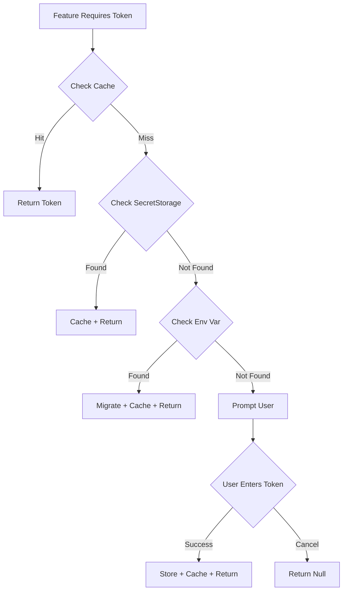
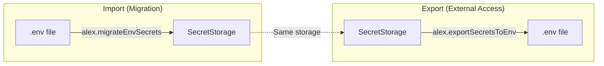

# Secrets Management Skill

Expert in secure credential storage for VS Code extensions using SecretStorage API, token lifecycle management, and security best practices.

## Capabilities

- Implement VS Code SecretStorage API patterns
- Migrate credentials from environment variables
- Detect secrets in .env files across workspace
- Design secure token entry UX/UI
- Manage token lifecycle (create, read, update, delete)
- Handle multi-platform encryption (Windows, macOS, Linux)
- Implement backward compatibility strategies
- Validate security patterns and prevent credential leaks
- Provide code migration guidance for applications

## When to Use This Skill

- User mentions "API key", "token", "secret", "credential", or "password"
- User mentions ".env file" or "environment variables" with secret context
- Creating features requiring external service authentication
- Migrating from environment variables to secure storage
- Implementing token management UI
- Reviewing code for credential security
- Setting up multi-platform credential storage
- Detecting hardcoded secrets in project files

## Core Concepts

### VS Code SecretStorage API

| Method | Purpose | Returns |
|--------|---------|---------|
| `secrets.store(key, value)` | Save encrypted credential | Promise<void> |
| `secrets.get(key)` | Retrieve credential | Promise<string \| undefined> |
| `secrets.delete(key)` | Remove credential | Promise<void> |
| `secrets.onDidChange` | Listen for changes | Event<SecretStorageChangeEvent> |

### Platform-Specific Storage

| Platform | Storage Backend | Encryption |
|----------|----------------|------------|
| **Windows** | Windows Credential Manager | DPAPI (Data Protection API) |
| **macOS** | Keychain | Keychain Services |
| **Linux** | Secret Service API (libsecret) | OS keyring (GNOME/KDE) |

### Token Configuration Pattern

```typescript
interface TokenConfig {
    key: string;                // SecretStorage key (namespaced)
    displayName: string;        // User-facing name
    description: string;        // Purpose explanation
    getUrl?: string;           // Where to obtain token
    placeholder?: string;      // Example format
    envVar?: string;           // Env var for migration
}
```

### Service Architecture

| Component | Responsibility |
|-----------|---------------|
| **SecretStorage** | OS-level encrypted storage (provided by VS Code) |
| **Token Cache** | In-memory Map for synchronous access |
| **Config Registry** | Token metadata (names, URLs, migration sources) |
| **Migration Service** | One-time env var → SecretStorage transfer |
| **UI Service** | Quick pick, input box, warning prompts |

### Security Best Practices

| Practice | Implementation |
|----------|----------------|
| **Namespace keys** | Use `extension.namespace.tokenName` format |
| **Never log tokens** | Use `[REDACTED]` in console output |
| **Validate input** | Check format before storage (regex patterns) |
| **Non-destructive migration** | Keep env vars as fallback |
| **Clear on error** | Don't cache failed retrievals |
| **Use placeholders** | Show format without real credentials |
| **Password input** | Set `password: true` on input boxes |

### Token Lifecycle Workflow



### Bidirectional Secrets Flow

SecretStorage is secure but inaccessible to external tools (CLI, PowerShell scripts, CI/CD). Solution: bidirectional flow.



| Direction | Command | Use Case |
|-----------|---------|----------|
| **Import** | `Alex: Migrate .env to Secrets` | Secure existing plaintext tokens |
| **Export** | `Alex: Export Secrets to .env` | Enable external tool access |

### Migration Strategy

| Phase | Action | Safety Measure |
|-------|--------|----------------|
| **Detection** | Check for env var AND empty SecretStorage | Only migrate if both conditions met |
| **Copy** | `secretStorage.store(key, process.env.VAR)` | Non-destructive (env var remains) |
| **Cache** | Update in-memory cache | Avoid redundant SecretStorage reads |
| **Fallback** | If SecretStorage fails, use env var | Backward compatibility maintained |
| **Logging** | Console log migration success | User visibility without exposing tokens |

### UI/UX Patterns

#### Token Entry Flow

```
1. Feature triggered without token
   ↓
2. Warning message with 3 options:
   - "Configure API Key" → Opens token manager
   - "Get API Key" → Opens service URL in browser
   - "Continue Anyway" → Proceeds (may fail)
   ↓
3. Token manager quick pick:
   - List all tokens with status icons
   - ✅ Configured | ❌ Not Configured
   ↓
4. Individual token prompt:
   - Input box with password masking
   - Placeholder showing format
   - Validation before storage
   ↓
5. Confirmation:
   - Success message
   - Return to feature workflow
```

#### Recommended Warning Template

```typescript
const result = await vscode.window.showWarningMessage(
  `${SERVICE} API Key not configured. Set your API key to use ${FEATURE}.`,
  "Configure API Key",
  "Get API Key", 
  "Continue Anyway"
);

if (result === "Configure API Key") {
  vscode.commands.executeCommand("extension.manageSecrets");
  return;
}
if (result === "Get API Key") {
  vscode.env.openExternal(vscode.Uri.parse(GET_URL));
  return;
}
// Continue Anyway falls through
```

### Token Registry Pattern

```typescript
const TOKEN_CONFIGS: Record<string, TokenConfig> = {
    SERVICE_TOKEN: {
        key: 'extension.secrets.serviceToken',
        displayName: 'Service API Token',
        description: 'API token for external service integration',
        getUrl: 'https://service.example.com/account/tokens',
        placeholder: 'svc_xxxxxxxxxxxxxxxxxxxx',
        envVar: 'SERVICE_API_TOKEN',
    },
    // Add more tokens as needed
};
```

### Synchronous Access Pattern

Many VS Code APIs are synchronous, but SecretStorage is async. Solution:

```typescript
// Module-level cache
const tokenCache: Map<string, string | null> = new Map();

// Async init (on activation)
async function initSecretsManager(context: vscode.ExtensionContext) {
    secretStorage = context.secrets;
    
    // Pre-load all tokens into cache
    for (const config of Object.values(TOKEN_CONFIGS)) {
        const token = await secretStorage.get(config.key);
        tokenCache.set(config.key, token || null);
    }
}

// Sync getter (safe after init)
function getToken(tokenName: string): string | null {
    return tokenCache.get(tokenName) ?? null;
}
```

### Common Pitfalls

| Pitfall | Solution |
|---------|----------|
| Calling SecretStorage before `activate()` | Initialize in activate(), check null |
| Async/sync mismatch | Use cache pattern for sync access |
| Logging actual tokens | Use `console.log(\`Migrated \${name}\`)` without value |
| Overwriting user tokens | Check storage before migration |
| Hard-coded API keys | Always use SecretStorage |
| No fallback for missing tokens | Warn + offer config, don't crash |
| Platform-specific code | VS Code SecretStorage abstracts OS differences |

### .env File Detection & Migration

Alex can automatically detect secrets in `.env` files and offer secure migration:

**Detection Pattern**:
```typescript
// Scan workspace for .env files (excludes .env.example, .env.template)
const envFiles = await vscode.workspace.findFiles('**/.env*', '**/node_modules/**');

// Parse for secret patterns
const secretKeywords = [
    'API_KEY', 'API_TOKEN', 'SECRET', 'PASSWORD', 'PASS',
    'TOKEN', 'AUTH', 'CREDENTIAL', 'PRIVATE_KEY',
    'ACCESS_KEY', 'SECRET_KEY', 'CLIENT_SECRET'
];

// Match: KEY_NAME=value (handles quotes, spaces, comments)
const envPattern = /^\s*([A-Z_][A-Z0-9_]*)\s*=\s*([^#\n]+)/i;
```

**Migration Workflow**:
1. **Scan**: Find all `.env` files in workspace
2. **Parse**: Detect environment variables matching secret patterns
3. **Classify**: Separate recognized tokens (matching TOKEN_CONFIGS) from custom
4. **Offer**: Show UI with auto-migrate option
5. **Migrate**: Copy values to SecretStorage (non-destructive)
6. **Guide**: Provide code migration instructions

**User Commands**:
- `Alex: Detect & Migrate .env Secrets` - Scan workspace for .env files
- `Alex: Export Secrets to .env` - Write SecretStorage tokens to .env for external tool access
- Quick action button in Welcome panel - "🔍 Detect .env Secrets"

**Migration UI Flow**:
```
🔍 Found 3 potential secret(s) in .env files:
✅ 2 recognized (can auto-migrate)
⚠️ 1 custom (requires manual setup)

[Review Secrets] [Auto-Migrate Recognized] [Cancel]
```

**Code Migration Guide**:
After migration, users must update their code:
- **VS Code extensions**: Use `context.secrets` API
- **Node.js apps**: Load from environment at runtime (CI/CD secrets, Azure Key Vault, etc.)
- **Scripts called by Alex**: Receive secrets as command-line arguments

**Security Benefits**:
- ✅ Removes plaintext secrets from `.env` files
- ✅ OS-level encryption (Credential Manager, Keychain, Secret Service)
- ✅ Prevents accidental commits to version control
- ✅ Consistent secret management across team

### Export Secrets to .env (External Tool Access)

VS Code SecretStorage is inaccessible to PowerShell scripts, CLI tools, and CI/CD pipelines. The export command bridges this gap.

**Why Export is Needed**:
- PowerShell scripts (like `brain-qa.ps1`) can't access SecretStorage
- External tools (Replicate CLI, OpenAI CLI) need env vars or .env
- CI/CD pipelines require explicit secret injection

**Export Implementation**:
```typescript
async function exportSecretsToEnv(): Promise<void> {
    const workspaceFolder = vscode.workspace.workspaceFolders?.[0];
    if (!workspaceFolder) return;
    
    const envPath = path.join(workspaceFolder.uri.fsPath, '.env');
    const secrets: string[] = [];
    
    // Collect cached secrets
    for (const [key, value] of tokenCache.entries()) {
        if (value) {
            // Find env var name from config
            const config = Object.values(TOKEN_CONFIGS)
                .find(c => c.key === key);
            if (config?.envVar) {
                secrets.push(`${config.envVar}=${value}`);
            }
        }
    }
    
    if (secrets.length === 0) {
        vscode.window.showWarningMessage('No secrets to export');
        return;
    }
    
    // Read existing .env, replace Alex section
    let content = '';
    if (fs.existsSync(envPath)) {
        content = fs.readFileSync(envPath, 'utf-8');
        // Remove existing Alex section
        content = content.replace(
            /\n?# Alex Secrets Export[\s\S]*?(?=\n#|$)/g, ''
        ).trim();
    }
    
    // Append new section
    const section = `\n\n# Alex Secrets Export (auto-generated)\n${secrets.join('\n')}`;
    fs.writeFileSync(envPath, content + section, 'utf-8');
    
    vscode.window.showInformationMessage(
        `Exported ${secrets.length} secret(s) to .env`
    );
}
```

**PowerShell Script Usage**:
```powershell
# Source the .env file in PowerShell
if (Test-Path .env) {
    Get-Content .env | ForEach-Object {
        if ($_ -match '^([^#=]+)=(.*)$') {
            [Environment]::SetEnvironmentVariable($matches[1].Trim(), $matches[2].Trim())
        }
    }
}

# Now $env:REPLICATE_API_TOKEN is available
```

**Security Considerations**:
- ⚠️ Exported .env contains plaintext secrets — add to `.gitignore`
- ⚠️ Re-export if tokens change in SecretStorage
- ✅ Markers identify Alex-managed section for safe updates
- ✅ Non-destructive — preserves existing .env content

## Implementation Checklist

### Service Setup
- [ ] Create `secretsManager.ts` service
- [ ] Define TOKEN_CONFIGS registry
- [ ] Initialize SecretStorage in activate()
- [ ] Implement token cache for sync access
- [ ] Add migration logic (env vars → SecretStorage)

### Core API
- [ ] `initSecretsManager(context)` - Set up storage + cache
- [ ] `getToken(name)` - Synchronous retrieval with fallback
- [ ] `setToken(name, value)` - Store + update cache
- [ ] `deleteToken(name)` - Remove + clear cache
- [ ] `migrateSecretsFromEnvironment()` - One-time migration

### UI Components
- [ ] Command: "Manage API Keys & Secrets"
- [ ] Command: "Detect & Migrate .env Secrets"
- [ ] Command: "Export Secrets to .env"
- [ ] Quick pick: List all tokens with status
- [ ] Quick pick: Review detected .env secrets
- [ ] Quick pick: Export confirmation with file open option
- [ ] Input prompt: Individual token entry with validation
- [ ] Warning template: Feature-specific token missing
- [ ] Success confirmation: Token saved message
- [ ] Migration guide: Code update instructions

### Integration
- [ ] Import secrets manager in extension.ts
- [ ] Call `initSecretsManager()` in activate()
- [ ] Register management command
- [ ] Update features to use `getToken()` instead of env vars
- [ ] Add "Configure API Key" options to warnings

### Testing
- [ ] Test on Windows (Credential Manager)
- [ ] Test on macOS (Keychain)
- [ ] Test on Linux (Secret Service)
- [ ] Verify migration from env vars
- [ ] Verify .env file detection and parsing
- [ ] Test auto-migration of recognized secrets
- [ ] Confirm persistence across VS Code restarts
- [ ] Validate cache updates on change

## Example Prompts

- "Add API key management for the new service"
- "Migrate from environment variables to SecretStorage"
- "Detect secrets in my .env files"
- "Export my secrets to .env for script access"
- "How do I access tokens from PowerShell scripts?"
- "Review this code for credential security issues"
- "Implement token management UI"
- "Why isn't my token persisting across sessions?"
- "How do I update my code after migrating .env secrets?"

## Input Expectations

- Service name and token type (API key, access token, etc.)
- Token format/pattern (for validation)
- Service URL for obtaining tokens
- Environment variable name (if migrating)

## Output Format

- Complete secretsManager.ts service implementation
- VS Code command registration
- UI integration (quick pick + input prompts)
- Migration logic for existing credentials
- Security review and recommendations

## Resources

- [VS Code SecretStorage API](https://code.visualstudio.com/api/references/vscode-api#SecretStorage)
- [VS Code Extension Samples - SecretStorage](https://github.com/microsoft/vscode-extension-samples/tree/main/secrets-sample)
- [Keytar (deprecated, replaced by SecretStorage)](https://github.com/atom/node-keytar)
