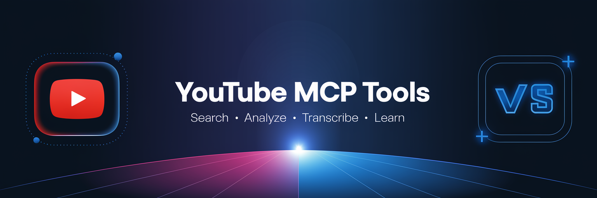

# YouTube MCP Tools for VS Code

<p align="center">
  
</p>

<p align="center">
  <a href="https://marketplace.visualstudio.com/items?itemName=fabioc-aloha.youtube-mcp-tools">
    
  </a>
  <a href="https://marketplace.visualstudio.com/items?itemName=fabioc-aloha.youtube-mcp-tools">
    
  </a>
  <a href="https://github.com/fabioc-aloha/youtube-mcp-vscode/blob/main/LICENSE">
    
  </a>
</p>

<p align="center">
  <strong>🎬 Bring YouTube video intelligence directly into VS Code</strong><br>
  Search • Analyze • Transcribe • Generate Flashcards
</p>

---

## ✨ Features

| Feature                           | Description                                                  |
| --------------------------------- | ------------------------------------------------------------ |
| 🔍**YouTube Search**        | Search videos directly from VS Code with instant results     |
| 📊**Video Analysis**        | AI-powered insights: summaries, key concepts, quality scores |
| 📝**Transcript Extraction** | Get timestamped transcripts for any video with captions      |
| 🎴**Flashcard Generation**  | Create study flashcards from video content automatically     |
| 📈**Quota Monitoring**      | Track your YouTube API usage in real-time                    |

## 🚀 Self-Sufficient Architecture

This extension requires **zero external servers or dependencies**. Everything runs directly within VS Code:

```
┌─────────────────────────────────────────────────────────┐
│                   VS Code Extension                     │
├─────────────────────────────────────────────────────────┤
│  ┌─────────────┐  ┌─────────────┐  ┌─────────────────┐  │
│  │   Search    │  │ Transcripts │  │    Analysis     │  │
│  │   Engine    │  │  Service    │  │     Engine      │  │
│  └──────┬──────┘  └──────┬──────┘  └────────┬────────┘  │
│         │                │                  │           │
│         └────────────────┼──────────────────┘           │
│                          ▼                              │
│              ┌───────────────────────┐                  │
│              │  YouTube Data API v3  │                  │
│              └───────────────────────┘                  │
└─────────────────────────────────────────────────────────┘
```

## 📦 Installation

1. Open VS Code
2. Press `Ctrl+P` / `Cmd+P`
3. Type `ext install fabioc-aloha.youtube-mcp-tools`
4. Press Enter

**Or** search for "YouTube MCP Tools" in the Extensions view.

## ⚙️ Setup

### Get a YouTube API Key

1. Go to [Google Cloud Console](https://console.cloud.google.com/apis/credentials)
2. Create a new project (or select existing)
3. Enable the **YouTube Data API v3**
4. Create an API Key
5. Copy the key

### Configure the Extension

**Option 1: VS Code Settings** (Recommended)

```
Ctrl+, → Search "youtubeMcp.apiKey" → Paste your key
```

**Option 2: .env File**
Create a `.env` file in your workspace root:

```env
YOUTUBE_API_KEY=your-api-key-here
```

## 🎯 Commands

| Command                              | Description                      |
| ------------------------------------ | -------------------------------- |
| `YouTube MCP: Search YouTube`      | Search for videos by keyword     |
| `YouTube MCP: Analyze Video`       | Get comprehensive video analysis |
| `YouTube MCP: Get Transcript`      | Extract timestamped transcript   |
| `YouTube MCP: Generate Flashcards` | Create flashcards from video     |
| `YouTube MCP: Show Quota Status`   | Check API quota usage            |
| `YouTube MCP: Open Settings`       | Configure extension settings     |

Access all commands via `Ctrl+Shift+P` / `Cmd+Shift+P`.

## 📊 Video Analysis Output

When you analyze a video, you get:

```markdown
# Video Title

**Channel:** Channel Name
**Duration:** 15m 30s
**Views:** 1,234,567 | **Likes:** 45,678

---

## Summary
Brief overview of the video content...

### Detailed
In-depth analysis of the video...

## Key Points
- Important point 1
- Important point 2
- Important point 3

## Key Concepts
### Machine Learning
Definition and context...
*Type: term | Mentions: 15*

## Quality Assessment
| Metric | Score |
|--------|-------|
| Overall | **85**/100 |
| Clarity | 90/100 |
| Depth | 80/100 |
| Structure | 85/100 |
| Engagement | 82/100 |
```

## 🎴 Flashcard Generation

Flashcards are generated from:

- **Key Points** extracted from the video
- **Concepts** identified in the content
- **Topics** covered in the video

Perfect for:

- 📚 Learning new technologies
- 🎓 Studying for certifications
- 💡 Retaining video course content

## ⚙️ Settings

| Setting                          | Default | Description                      |
| -------------------------------- | ------- | -------------------------------- |
| `youtubeMcp.apiKey`            | -       | Your YouTube Data API key        |
| `youtubeMcp.maxResults`        | 10      | Search results (1-50)            |
| `youtubeMcp.preferredDuration` | any     | Filter: any, short, medium, long |
| `youtubeMcp.defaultRegion`     | US      | Region code for searches         |
| `youtubeMcp.autoAnalyze`       | false   | Auto-analyze on video select     |

## 📁 Activity Bar Views

Look for the **YouTube** icon in the Activity Bar:

- **🔍 Search Results** - Videos from your last search
- **📜 Recent Videos** - Your video history
- **🎴 Flashcards** - Generated study cards

## 🔒 Privacy & Security

- ✅ API keys stored locally in VS Code settings or `.env`
- ✅ No data sent to third-party servers
- ✅ No telemetry or tracking
- ✅ All processing happens locally

## 📝 Requirements

- VS Code 1.108.1 or higher
- YouTube Data API key ([Get one free](https://console.cloud.google.com/apis/credentials))

## 🤝 Contributing

Contributions welcome! Please see our [GitHub repository](https://github.com/fabioc-aloha/youtube-mcp-vscode).

1. Fork the repository
2. Create a feature branch (`git checkout -b feature/amazing-feature`)
3. Commit your changes (`git commit -m 'Add amazing feature'`)
4. Push to the branch (`git push origin feature/amazing-feature`)
5. Open a Pull Request

## 📄 License

This project is licensed under the MIT License - see the [LICENSE](LICENSE) file for details.

---

<p align="center">
  <a href="https://correax.com">
    
  </a>
</p>

<p align="center">
  <strong>Made with ❤️ by <a href="https://correax.com">CorreaX</a></strong><br>
  <sub>Building intelligent tools for developers</sub>
</p>

<p align="center">
  <a href="https://github.com/fabioc-aloha/youtube-mcp-vscode/issues">Report Bug</a> •
  <a href="https://github.com/fabioc-aloha/youtube-mcp-vscode/issues">Request Feature</a> •
  <a href="https://github.com/fabioc-aloha/youtube-mcp-vscode/stargazers">⭐ Star on GitHub</a>
</p>
