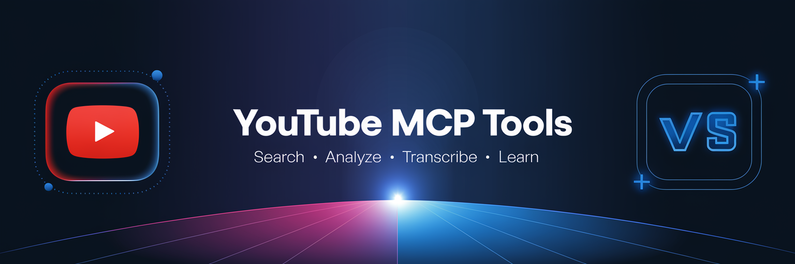

# YouTube MCP Tools for VS Code

<p align="center">
  
</p>

<p align="center">
  <a href="https://marketplace.visualstudio.com/items?itemName=fabioc-aloha.youtube-mcp-tools">
    
  </a>
  <a href="https://marketplace.visualstudio.com/items?itemName=fabioc-aloha.youtube-mcp-tools">
    
  </a>
  <a href="https://github.com/fabioc-aloha/youtube-mcp-vscode/blob/main/LICENSE">
    
  </a>
</p>

<p align="center">
  <strong>🎬 Bring YouTube video intelligence directly into VS Code</strong><br>
  Search • Analyze • Transcribe • Generate Flashcards
</p>

---

## ✨ What it does

| Tool | API key needed? | Use case |
|---|---|---|
| 📝 **Get transcript** | ❌ No | "Give me the transcript of this video" — returns Markdown with clickable timestamps so an AI can cite specific moments and you can jump there |
| 🔎 **Search inside transcript** | ❌ No | "Where in this 2-hour podcast did they mention X?" — returns matching moments + deep-link URLs, far cheaper than dumping the whole transcript into the AI |
| 📈 **Quota status** | ❌ No | See how much YouTube Data API quota this server has used |
| 🔍 **Search YouTube** | ✅ Yes | Search for videos by query (100 quota units = ~100 searches/day on free tier) |
| 📊 **Get video details** | ✅ Yes | Title, channel, duration, view/like counts, tags, caption availability |
| 🧠 **Analyze video** | ✅ Yes | Summary, key points, topics, extracted concepts, observable quality signals |
| 🎴 **Generate flashcards** | ✅ Yes | Front/back study cards from key concepts |

> **The transcript tools work without a Google API key.** That covers the
> single most common use case ("summarize this video for me") with zero
> setup. Add an API key later if you want search and analysis too.

## ⚡ Quick start (MCP server, no API key)

The fastest way to try it from any MCP client (Claude Desktop, VS Code Agent
Mode, Cursor, custom agents):

**1. Add to your MCP client config**

`.vscode/mcp.json`:

```json
{
  "servers": {
    "youtube": {
      "command": "node",
      "args": ["${workspaceFolder}/node_modules/youtube-mcp-tools/dist/mcp-server.js"]
    }
  }
}
```

Claude Desktop (`claude_desktop_config.json`):

```json
{
  "mcpServers": {
    "youtube": {
      "command": "node",
      "args": ["/absolute/path/to/dist/mcp-server.js"]
    }
  }
}
```

**2. Ask your AI**

> "Get the transcript of `https://youtu.be/jNQXAC9IVRw` and tell me what it's about."

> "In `https://youtu.be/dQw4w9WgXcQ`, where do they say 'never gonna'?"

The AI calls `youtube_get_transcript` or `youtube_search_transcript`, gets
back Markdown with `[03:42](https://youtu.be/X?t=222)` clickable timestamps,
and cites them in its answer.

**3. (Optional) Add an API key for richer tools**

Set `YOUTUBE_API_KEY` in your MCP client's `env` block to unlock search,
video details, full analysis, and flashcards.

## 📦 Installation (VS Code extension)

1. Open VS Code
2. Press `Ctrl+P` / `Cmd+P`
3. Type `ext install fabioc-aloha.youtube-mcp-tools`
4. Press Enter

**Or** search for "YouTube MCP Tools" in the Extensions view.

## ⚙️ Setup

### Get a YouTube API Key

1. Go to [Google Cloud Console](https://console.cloud.google.com/apis/credentials)
2. Create a new project (or select existing)
3. Enable the **YouTube Data API v3**
4. Create an API Key
5. Copy the key

### Configure the Extension

**Option 1: VS Code Settings** (Recommended)

```
Ctrl+, → Search "youtubeMcp.apiKey" → Paste your key
```

**Option 2: .env File**
Create a `.env` file in your workspace root:

```env
YOUTUBE_API_KEY=your-api-key-here
```

**Option 3: Secure Command** (Recommended)

Run `YouTube MCP: Set API Key` command. Your key is:
- Validated before storage
- Encrypted using VS Code SecretStorage
- Never exposed in settings or files

## 🎯 Commands

| Command | Shortcut | Description |
|---------|----------|-------------|
| `YouTube MCP: Search YouTube` | `Ctrl+Shift+Y S` | Search for videos by keyword |
| `YouTube MCP: Analyze Video` | `Ctrl+Shift+Y A` | Get comprehensive video analysis |
| `YouTube MCP: Get Transcript` | `Ctrl+Shift+Y T` | Extract timestamped transcript |
| `YouTube MCP: Generate Flashcards` | `Ctrl+Shift+Y F` | Create flashcards from video |
| `YouTube MCP: Set API Key` | - | Securely set your API key |
| `YouTube MCP: Show Quota Status` | - | Check API quota usage |
| `YouTube MCP: Open Settings` | - | Configure extension settings |

Access all commands via `Ctrl+Shift+P` / `Cmd+Shift+P`.

## 🔒 Security Features

- **Encrypted Storage** - API keys stored in VS Code's SecretStorage
- **Key Validation** - API keys validated before storage
- **Rate Limiting** - Automatic request throttling (10 req/sec)
- **Exponential Backoff** - Smart retries for transient failures
- **Quota Persistence** - Usage tracking persists across sessions

## 📊 Video Analysis Output

When you analyze a video, you get:

```markdown
# Video Title

**Channel:** Channel Name
**Duration:** 15m 30s
**Views:** 1,234,567 | **Likes:** 45,678

---

## Summary
Brief overview of the video content...

### Detailed
In-depth analysis of the video...

## Key Points
- Important point 1
- Important point 2
- Important point 3

## Key Concepts
### Machine Learning
Definition and context...
*Type: term | Mentions: 15*

## Quality Signals
| Signal | Value |
|--------|-------|
| Has captions | yes |
| Word count | 4,318 |
| Avg sentence length | 18 words |
| Engagement (likes/views) | 3.70% |
| Transcript segments | 412 |
```

> Quality is reported as **measurable signals**, not opaque 0–100 scores.
> Interpret them per your use case — long-form lectures want different
> signals than short tutorials.

## 🤖 Use From Any MCP Client

Beyond the VS Code UI, this package ships a standalone **Model Context
Protocol** server (`youtube-mcp-server`). Any MCP-aware client can call its
tools — `youtube_search`, `youtube_get_video_details`,
`youtube_get_transcript`, `youtube_analyze_video`,
`youtube_generate_flashcards`, `youtube_quota_status`.

### VS Code Agent Mode (`.vscode/mcp.json`)

```json
{
  "servers": {
    "youtube": {
      "command": "node",
      "args": ["${workspaceFolder}/node_modules/youtube-mcp-tools/dist/mcp-server.js"],
      "env": { "YOUTUBE_API_KEY": "${env:YOUTUBE_API_KEY}" }
    }
  }
}
```

### Claude Desktop (`claude_desktop_config.json`)

```json
{
  "mcpServers": {
    "youtube": {
      "command": "node",
      "args": ["/absolute/path/to/dist/mcp-server.js"],
      "env": { "YOUTUBE_API_KEY": "AIza..." }
    }
  }
}
```

### Standalone

```bash
YOUTUBE_API_KEY=AIza... node dist/mcp-server.js
```

The server speaks JSON-RPC over stdio. Logs go to stderr only — stdout is
reserved for the protocol channel.

## 🎴 Flashcard Generation

Flashcards are generated from:

- **Key Points** extracted from the video
- **Concepts** identified in the content
- **Topics** covered in the video

Perfect for:

- 📚 Learning new technologies
- 🎓 Studying for certifications
- 💡 Retaining video course content

## ⚙️ Settings

| Setting | Default | Description |
|---------|---------|-------------|
| `youtubeMcp.apiKey` | - | Your YouTube Data API key |
| `youtubeMcp.maxResults` | 10 | Search results (1-50) |
| `youtubeMcp.preferredDuration` | any | Filter: any, short, medium, long |
| `youtubeMcp.defaultRegion` | US | Region code for searches |
| `youtubeMcp.autoAnalyze` | false | Auto-analyze on video select |

## 📁 Activity Bar Views

Look for the **YouTube** icon in the Activity Bar:

- **🔍 Search Results** - Videos from your last search
- **📜 Recent Videos** - Your video history
- **🎴 Flashcards** - Generated study cards

## 🔒 Privacy & Security

- ✅ API keys stored locally in VS Code settings or `.env`
- ✅ No data sent to third-party servers
- ✅ No telemetry or tracking
- ✅ All processing happens locally

## 📝 Requirements

- VS Code 1.109.0 or higher
- YouTube Data API key ([Get one free](https://console.cloud.google.com/apis/credentials))

## 🤝 Contributing

Contributions welcome! Please see our [GitHub repository](https://github.com/fabioc-aloha/youtube-mcp-vscode).

1. Fork the repository
2. Create a feature branch (`git checkout -b feature/amazing-feature`)
3. Commit your changes (`git commit -m 'Add amazing feature'`)
4. Push to the branch (`git push origin feature/amazing-feature`)
5. Open a Pull Request

## 📄 License

This project is licensed under the MIT License - see the [LICENSE](LICENSE) file for details.

---

<p align="center">
  <a href="https://correax.com">
    
  </a>
</p>

<p align="center">
  <strong>Made with ❤️ by <a href="https://correax.com">CorreaX</a></strong><br>
  <sub>Building intelligent tools for developers</sub>
</p>

<p align="center">
  <a href="https://github.com/fabioc-aloha/youtube-mcp-vscode/issues">Report Bug</a> •
  <a href="https://github.com/fabioc-aloha/youtube-mcp-vscode/issues">Request Feature</a> •
  <a href="https://github.com/fabioc-aloha/youtube-mcp-vscode/stargazers">⭐ Star on GitHub</a>
</p>
